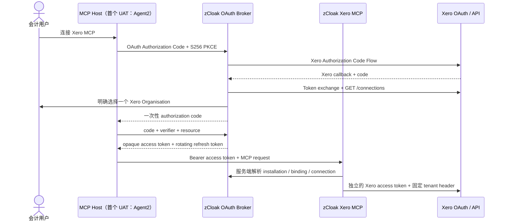

# MCP OAuth Broker Contract V1

状态：`IMPLEMENTATION CONTRACT`  
版本：`1.0`  
基准日期：`2026-08-05`  
首个线上 UAT 客户端：`Agent2`  

> 本合同定义 `MCP Host -> zCloak OAuth Broker / MCP -> Xero` 的双层 OAuth。它是协议、数据绑定和验收合同，不代表相应能力已经部署或通过线上验收。

## 1. 目标与硬边界

### 1.1 目标链路



### 1.2 两层 Token 永远分开

| 层 | OAuth Client | Authorization Server | Resource Server | Token 的接收者 |
|---|---|---|---|---|
| 外层 MCP OAuth | Agent2 或其他 MCP Host | zCloak OAuth Broker | zCloak Xero MCP | MCP Host 只持有 zCloak Token |
| 内层 Xero OAuth | zCloak Broker | Xero Identity | Xero API | 只有 zCloak Broker/Provider Adapter 持有 Xero Token |

硬约束：

1. zCloak MCP **不得**把外层 MCP Token 转发给 Xero。
2. zCloak **不得**把 Xero Access Token、Refresh Token、ID Token 或 Client Secret 返回给 MCP Host、Agent、模型上下文或工具结果。
3. Xero Tenant ID 不得由工具参数、提示词、普通 Header 或模型决定；它只能由服务端已验证的 `AgentConnectionBinding` 解析。
4. Xero 是正式账本。Broker 数据库只保存授权、连接、绑定、Token 状态和审计，不复制完整总账。
5. 一个 OAuth installation 在任何时刻只绑定一个有效 `ProviderConnection`。

以上符合 MCP 对 audience validation 与禁止 token passthrough 的要求。[MCP Authorization](https://modelcontextprotocol.io/specification/2025-11-25/basic/authorization)

## 2. 规范基线与解释优先级

实现按以下优先级解释：

1. [MCP Authorization 2025-11-25](https://modelcontextprotocol.io/specification/2025-11-25/basic/authorization)；
2. [RFC 9728 — OAuth 2.0 Protected Resource Metadata](https://www.rfc-editor.org/rfc/rfc9728.html)；
3. [RFC 8414 — OAuth 2.0 Authorization Server Metadata](https://www.rfc-editor.org/rfc/rfc8414.html)；
4. [RFC 8707 — Resource Indicators for OAuth 2.0](https://www.rfc-editor.org/rfc/rfc8707.html)；
5. [RFC 7636 — PKCE](https://www.rfc-editor.org/rfc/rfc7636.html)；
6. [RFC 7009 — Token Revocation](https://www.rfc-editor.org/rfc/rfc7009.html)；
7. [Xero OAuth 2.0 overview](https://developer.xero.com/documentation/guides/oauth2/overview)、[standard authorization code flow](https://developer.xero.com/documentation/guides/oauth2/auth-flow/)、[scopes](https://developer.xero.com/documentation/guides/oauth2/scopes/) 与 [token types](https://developer.xero.com/documentation/guides/oauth2/token-types)。

MCP 规范要求 HTTP MCP 的 Authorization Server 遵循 OAuth 2.1 安全基线。若底层 RFC 的可选项与本合同的更严格规则不同，以本合同的 `MUST` 为准。

## 3. 固定公开地址

当前生产候选 Origin 是 `https://mcp.jiayuanwang.xyz`。以下值必须从配置派生，代码中不得硬编码域名：

| 名称 | 当前生产候选值 |
|---|---|
| Broker issuer | `https://mcp.jiayuanwang.xyz` |
| MCP canonical resource | `https://mcp.jiayuanwang.xyz/mcp` |
| Protected Resource Metadata | `https://mcp.jiayuanwang.xyz/.well-known/oauth-protected-resource/mcp` |
| Authorization Server Metadata | `https://mcp.jiayuanwang.xyz/.well-known/oauth-authorization-server` |
| Authorization endpoint | `https://mcp.jiayuanwang.xyz/authorize` |
| Token endpoint | `https://mcp.jiayuanwang.xyz/token` |
| Revocation endpoint | `https://mcp.jiayuanwang.xyz/revoke` |
| Xero callback | `https://mcp.jiayuanwang.xyz/oauth/xero/callback` |

`issuer` 不带 path、query 或 fragment。`resource` 使用最具体的 MCP endpoint URI，全文统一使用无末尾 `/` 的同一字符串。

## 4. MCP Protected Resource Metadata

### 4.1 Path-specific metadata

MCP Server `MUST` 提供：

```http
GET /.well-known/oauth-protected-resource/mcp HTTP/1.1
Host: mcp.jiayuanwang.xyz
Accept: application/json
```

```json
{
  "resource": "https://mcp.jiayuanwang.xyz/mcp",
  "authorization_servers": [
    "https://mcp.jiayuanwang.xyz"
  ],
  "bearer_methods_supported": ["header"],
  "scopes_supported": [
    "xero.read",
    "xero.draft.write"
  ],
  "resource_name": "zCloak Xero Accounting MCP"
}
```

规则：

- `resource` 必须与 canonical resource 完全一致。
- `authorization_servers` V1 只列一个可信 issuer。
- 只支持 `Authorization: Bearer` Header；不接受 query-string 或 request-body token。
- `scopes_supported` 只发布已经上线并有策略保护的能力。未上线 scope 不得提前发布。
- 可以额外在根路径 `/.well-known/oauth-protected-resource` 提供内容相同的兼容 alias，但 path-specific 地址是权威地址。

[RFC 9728](https://www.rfc-editor.org/rfc/rfc9728.html) 规定 protected resource metadata 的权威 well-known 位置；当前 MCP 规范要求客户端优先使用 challenge 中的地址，并在缺失时按 path-specific、root 顺序发现。

### 4.2 未授权 challenge

无 Token、Token 无效、过期或已撤销时：

```http
HTTP/1.1 401 Unauthorized
WWW-Authenticate: Bearer resource_metadata="https://mcp.jiayuanwang.xyz/.well-known/oauth-protected-resource/mcp", scope="xero.read"
Cache-Control: no-store
```

Token 有效但 scope 不足时：

```http
HTTP/1.1 403 Forbidden
WWW-Authenticate: Bearer error="insufficient_scope", scope="xero.read xero.draft.write", resource_metadata="https://mcp.jiayuanwang.xyz/.well-known/oauth-protected-resource/mcp"
Cache-Control: no-store
```

不得在 `error_description` 中泄漏 installation、用户、Xero tenant、Token hash 或内部策略。

## 5. Authorization Server Metadata

Broker `MUST` 返回：

```http
GET /.well-known/oauth-authorization-server HTTP/1.1
Host: mcp.jiayuanwang.xyz
Accept: application/json
```

```json
{
  "issuer": "https://mcp.jiayuanwang.xyz",
  "authorization_endpoint": "https://mcp.jiayuanwang.xyz/authorize",
  "token_endpoint": "https://mcp.jiayuanwang.xyz/token",
  "revocation_endpoint": "https://mcp.jiayuanwang.xyz/revoke",
  "scopes_supported": [
    "xero.read",
    "xero.draft.write"
  ],
  "response_types_supported": ["code"],
  "grant_types_supported": ["authorization_code", "refresh_token"],
  "token_endpoint_auth_methods_supported": ["client_secret_basic", "client_secret_post"],
  "revocation_endpoint_auth_methods_supported": ["client_secret_basic", "client_secret_post"],
  "code_challenge_methods_supported": ["S256"],
  "protected_resources": [
    "https://mcp.jiayuanwang.xyz/mcp"
  ]
}
```

V1 决策：

- Agent2 采用预注册 confidential client；不开放匿名 Dynamic Client Registration。
- Agent2 V1 的 Token 与 revoke 端点接受 `client_secret_basic` 或 `client_secret_post`，但同一请求只能使用一种，重复 Header、重复表单字段或 Header + body 混用必须拒绝。服务端必须在任何日志、审计和错误处理之前过滤 `client_secret`，并对 Secret 做常量时间比较。
- 只支持 Authorization Code，不支持 implicit、password 或外层 client credentials。
- 只支持 `S256`，不支持 `plain`。
- 当前不发布 `jwks_uri`：外层 Access Token 是 opaque token，不是 JWT。
- 当前不发布 introspection endpoint：MCP 与 Broker 共用可信服务端存储进行本地解析。未来若拆分资源服务，另行增加 RFC 7662 合同。

预注册客户端符合 MCP 对已有客户端/服务端关系的注册路径。若未来支持 Client ID Metadata Document 或 DCR，必须另行威胁审查，不能静默放宽 V1。

## 6. 外层 MCP Authorization Code Flow

### 6.1 Host 请求

Agent2 或其他 Host 发起：

```http
GET /authorize?
  response_type=code&
  client_id=<registered_client_id>&
  redirect_uri=<exact_registered_callback>&
  scope=xero.read&
  state=<host_random_state>&
  code_challenge=<base64url_sha256>&
  code_challenge_method=S256&
  resource=https%3A%2F%2Fmcp.jiayuanwang.xyz%2Fmcp
```

Broker 在产生任何外部跳转前 `MUST` 依次验证：

1. `response_type` 恰为 `code`；
2. `client_id` 为 ACTIVE 的预注册客户端；
3. `redirect_uri` 与该客户端 allowlist 中一项逐字节相等；
4. `state` 存在、非空且长度有界；
5. `code_challenge_method` 恰为 `S256`；
6. `code_challenge` 是合法的 43–128 字符 base64url 值；
7. `resource` 恰为 canonical MCP resource；
8. `scope` 是已发布 scopes 的非空子集；
9. 生产模式下已获得可信、稳定的 Host installation identity，见第 11 节。

任一项失败都不得启动 Xero OAuth。

### 6.2 S256 PKCE

Host 为每次请求生成 43–128 字符高熵 `code_verifier`，并发送：

```text
code_challenge = BASE64URL-ENCODE(SHA256(ASCII(code_verifier)))
code_challenge_method = S256
```

Broker 把 challenge 绑定到一次性 authorization code；Token exchange 时常量时间比较重新计算的 challenge。缺失 PKCE、使用 `plain`、错误 verifier 或 downgrade 均返回错误，不允许回退。[RFC 7636](https://www.rfc-editor.org/rfc/rfc7636.html)

### 6.3 Exact redirect URI

- 每个 Host client 可以注册多个明确的 callback，但不允许 wildcard、正则、相对 URI 或动态 host。
- Broker 比较的是注册的完整 URI 字符串；不自动改写 scheme、host、port、path、query、大小写、编码或末尾 `/`。
- Token exchange 中的 `redirect_uri` 必须与 authorize 请求及 authorization code 中保存的值完全一致。
- 只有 `client_id` 与 `redirect_uri` 均已验证，Broker 才可以把 OAuth error 重定向回 Host；否则直接显示本地 400 页面。
- Agent2 首个 UAT slot 的 Unique Server Identifier 已确认为 `accounting-mcp`，因此其 exact callback 是 `https://agent2.zcloak.ai/api/mcp/accounting-mcp/oauth/callback`；必须把这一完整字符串写入该 client 的 allowlist。
- LibreChat/Work 的已知 callback 形态是 `https://<host>/api/mcp/<server-name>/oauth/callback`，但这只是兼容性参考，不能硬编码为 Agent2 或其他 Host 的 callback。[LibreChat MCP docs](https://www.librechat.ai/docs/features/mcp)

### 6.4 Resource 与 audience

[MCP Authorization](https://modelcontextprotocol.io/specification/2025-11-25/basic/authorization) 要求 Host 在 authorization request 和 token request 都发送 [RFC 8707](https://www.rfc-editor.org/rfc/rfc8707.html) `resource`。

V1 只接受一个值：

```text
resource = https://mcp.jiayuanwang.xyz/mcp
audience = https://mcp.jiayuanwang.xyz/mcp
```

授权码、Access Token 和 Refresh Token family 都持久化同一 `resource/audience`。Access Token 虽为 opaque，MCP 仍须从服务端 Token 记录验证 audience；匹配失败返回 401。不得把 Host 的 Token 用于 Review API、管理 API、Xero API 或其他 MCP。

生产模式不允许缺省 `resource`。若 Host 不发送它，只能在明确标记的单人 POC 兼容开关下测试；该结果不算 MCP Authorization 合规通过。

## 7. Browser flow、state 与重放保护

### 7.1 两个 state 不得混用

| 值 | 生成方 | 用途 | 是否可承载身份 |
|---|---|---|---|
| Host `state` | MCP Host | Broker 最终回跳 Host 时原样返回 | 否 |
| Xero `state` | zCloak Broker | 绑定 Broker 到 Xero callback | 否 |

Host 的 `state`、LibreChat 内部 `userId:serverName`、普通 query 参数或模型输入都不是服务端可信身份声明。

### 7.2 Broker flow record

Broker 创建 256-bit 随机 `flow_secret`，只向浏览器发送原值，在数据库只保存 keyed hash，并保存：

- client ID、exact redirect URI、outer state 的短时加密值及 keyed hash；
- PKCE challenge/method；
- resource、requested scopes；
- 已验证的 Host installation identity，或明确的 personal-POC principal；
- 256-bit 随机 Xero state hash；
- browser session hash、创建时间、过期时间、消费状态。

浏览器 Cookie：

```text
__Host-zcloak_oauth_flow=<random>
Secure; HttpOnly; SameSite=Lax; Path=/
```

规则：

- flow 默认 10 分钟过期；只能消费一次。
- Xero callback 必须同时匹配 Xero state、flow、浏览器 Cookie 与未过期状态。
- 选择 Organisation 的 POST 还必须携带独立、一次性 CSRF token。
- callback 进入原子 `EXCHANGING` 状态后才兑换 Xero code；并发 callback 只有一个成功。
- Authorization code、Xero state 与 Token 只记录 keyed hash；outer state 因最终必须原样返回 Host，只能在 flow TTL 内加密保存，消费后立即删除。日志只记录 request ID 和安全状态码。
- 浏览器绑定失败、state mismatch、过期、重复 callback 均 fail closed，不尝试猜测或恢复到其他 installation。

## 8. 内层 Xero OAuth

### 8.1 Flow 选择

zCloak Broker 是能够安全保存 Client Secret 的服务器端 Web 应用，因此 V1 使用 Xero 官方推荐的 **standard authorization code flow**，并在 Token 端点用 `client_secret_basic`。外层 Host -> Broker 仍强制 S256 PKCE。

Xero 的 PKCE app 是面向不能保存 secret 的移动/桌面应用；除非 Xero App 的 grant type 被明确改为 `Auth Code with PKCE`，Broker 不得把外层 verifier/challenge 复用到内层 Xero flow。[Xero standard flow](https://developer.xero.com/documentation/guides/oauth2/auth-flow/)、[Xero PKCE flow](https://developer.xero.com/documentation/guides/oauth2/pkce-flow)

### 8.2 Xero authorize request

```text
GET https://login.xero.com/identity/connect/authorize
  ?response_type=code
  &client_id=<XERO_CLIENT_ID>
  &redirect_uri=https%3A%2F%2Fmcp.jiayuanwang.xyz%2Foauth%2Fxero%2Fcallback
  &scope=<space-separated Xero scopes>
  &state=<one-time broker xero_state>
```

Xero callback 必须在 Xero Developer Portal 精确注册为：

```text
https://mcp.jiayuanwang.xyz/oauth/xero/callback
```

不允许 wildcard；Token exchange 再发送完全相同的 `redirect_uri`。Xero 授权码只可兑换一次且约 5 分钟过期；state 不匹配必须中止。[Xero standard flow](https://developer.xero.com/documentation/guides/oauth2/auth-flow/)、[Xero OAuth FAQ](https://developer.xero.com/faq/oauth2)

### 8.3 Xero Token exchange 与保存

```http
POST https://identity.xero.com/connect/token
Authorization: Basic base64(<XERO_CLIENT_ID>:<XERO_CLIENT_SECRET>)
Content-Type: application/x-www-form-urlencoded

grant_type=authorization_code&
code=<xero_code>&
redirect_uri=https%3A%2F%2Fmcp.jiayuanwang.xyz%2Foauth%2Fxero%2Fcallback
```

要求：

- Access Token、Refresh Token、ID Token 和 granted scopes 归 `ProviderAuthorization` 所有，不归 `ProviderConnection` 所有。
- Token set 用独立 KMS/信封密钥加密；密钥不与数据库同存，以 `authorization_id` 作 AAD。
- Xero Access Token 约 30 分钟；`offline_access` 产生 Refresh Token；未使用的 Refresh Token 约 60 天过期。
- 每次 Xero refresh 都保存新的 Access Token 与 Refresh Token；按 `authorization_id` 加数据库锁或 lease，并用 `refresh_version` CAS。
- Xero 官方允许刷新失败时在 30 分钟 grace period 内重试旧 Refresh Token；实现必须在同一授权上串行化，不能让多实例盲目并发刷新。[Xero token types](https://developer.xero.com/documentation/guides/oauth2/token-types)

### 8.4 Xero scope bundle

外层 MCP scope 是产品能力上限；内层 Xero scope 是 Provider API 权限。二者不是可互换 Token，也不是简单透传字符串。

| 外层 MCP scope | V1 Xero scope bundle | 产品限制 |
|---|---|---|
| `xero.read` | `openid profile email offline_access accounting.invoices.read accounting.payments.read accounting.contacts.read accounting.settings.read accounting.reports.trialbalance.read` | 只读、有界的 Invoice/Bill、Credit Note、Payment 与 Trial Balance 查询 |
| `xero.draft.write` | 在 read bundle 上增加 `accounting.invoices` | 只允许 DRAFT 交易；不能因此 AUTHORISE、付款或删除 |

说明：

- 附件、额外报表、银行交易、Manual Journal 等 scope 只有相应工具上线后才进入版本化 bundle；`accounting.payments.read` 只允许付款历史读取，不授予付款写入。
- 截至基准日期，Xero 已为 Web/PKCE apps 分配 granular accounting scopes；新实现不得继续假定宽泛的 `accounting.transactions` 永久可用。
- Xero scopes 是 additive；无法从现有 Token 中减少。降权必须撤销并重新授权。
- Broker 初次默认请求 `xero.read`。写草稿时用 403 `insufficient_scope` 触发 step-up；如果 Agent2 暂不支持增量授权，受控 UAT 可以首次同时请求两项，但必须记录为客户端 UX 限制。
- Broker 只有在当前 `ProviderAuthorization.granted_scopes` 已覆盖对应 Xero bundle 后，才可授予外层 MCP scope；若未覆盖，必须先重新进入 Xero consent 完成增量授权，不能只扩大外层 Token。

[Xero scopes](https://developer.xero.com/documentation/guides/oauth2/scopes/)

## 9. Xero callback 后的多 Organisation 选择

### 9.1 Connections discovery

兑换 Xero Token 后，Broker 调用：

```http
GET https://api.xero.com/connections
Authorization: Bearer <xero_access_token>
Accept: application/json
```

Broker 保存每个返回项的 Xero `connection id`、`tenantId`、`tenantName`、`tenantType`、created/updated time 和当前 `authorization_id`。若可用，可用 Access Token 的 `authentication_event_id` 过滤本次授权新连接，但不能因此忽略既有有效连接。[Xero tenants and connections](https://developer.xero.com/documentation/guides/oauth2/tenants/)、[Xero standard flow](https://developer.xero.com/documentation/guides/oauth2/auth-flow/)

### 9.2 人工选择规则

1. UI 必须展示 Organisation 名称与非敏感识别信息。
2. 即使只返回一个 Organisation，也必须让用户确认；多个时必须明确选择一个。
3. 禁止默认 `connections[0]`、最近使用项、字母排序第一项或让 Agent/模型选择。
4. 选择提交必须来自同一受绑定浏览器，带一次性 CSRF token。
5. 用户只能选择本次 `ProviderAuthorization` 当前可访问且状态 ACTIVE 的 connection。
6. 选择后创建或激活：`OAuthInstallation -> AgentConnectionBinding -> ProviderConnection`。
7. 数据库强制 `UNIQUE(oauth_installation_id)`；一次 installation 只能有一个 ACTIVE binding/connection。
8. authorization code 必须在选择完成后才签发，并绑定 installation、binding 和 connection 三元组。

若用户想使用第二个 Xero Organisation，必须在 Host 创建第二个可区分的 OAuth installation 并再次人工选择。Host 若不能表达多个 installation，V1 不允许 Agent 自由切换账套。

### 9.3 运行时 tenant 解析

每次 MCP 请求：

```text
opaque token hash
  -> active token record
  -> active installation
  -> active binding
  -> active provider connection
  -> provider authorization token set
  -> server-selected Xero tenantId
```

Provider Adapter 只用该 `tenantId` 构造 `xero-tenant-id` Header。任何调用方提供的 `tenant_id`、`connection_id`、`workspace_id` 或 `actor_id` 均不得覆盖服务端结果。

## 10. Authorization code 与外层 Token

### 10.1 Authorization code

- 256-bit CSPRNG opaque value；数据库只保存 keyed hash。
- 默认 5 分钟过期；原子单次消费。
- 绑定 `client_id + exact redirect_uri + S256 challenge + resource + audience + scopes + installation_id + binding_id + connection_id`。
- 任何字段不一致返回 `invalid_grant`；不得说明具体哪个绑定字段不一致。
- 重复兑换永不返回已有 Token。

Organisation 选择和 Binding 事务提交成功后，Broker 才创建 code、消费 browser flow，并返回：

```http
HTTP/1.1 302 Found
Location: <exact_registered_callback>?code=<opaque_code>&state=<original_host_state>
Cache-Control: no-store
```

若注册 callback 已有 query，必须用标准 URL API 安全追加参数；不得字符串拼接、改写原 callback 或把 code/state 放入 fragment。

### 10.2 Token endpoint：authorization_code

```http
POST /token
Content-Type: application/x-www-form-urlencoded

grant_type=authorization_code&
client_id=<HOST_CLIENT_ID>&
client_secret=<HOST_CLIENT_SECRET>&
code=<opaque_code>&
redirect_uri=<exact_registered_callback>&
code_verifier=<original_verifier>&
resource=https%3A%2F%2Fmcp.jiayuanwang.xyz%2Fmcp
```

成功返回：

```json
{
  "access_token": "<opaque_random_value>",
  "token_type": "Bearer",
  "expires_in": 900,
  "refresh_token": "<opaque_random_value>",
  "scope": "xero.read"
}
```

授权码消费、Access Token 保存与初始 Refresh Token family/Token 保存必须在同一个数据库事务中全成或全败。Broker 只能调用复合存储操作 `exchangeOAuthAuthorizationCodeForTokenSet({ grant, accessToken, refreshTokenFamily })`；不得先调用 compatibility primitive 消费 code 后再分步保存 Token。传入存储层的 access/refresh 均只能是 hash，Access Token 必须绑定新 family，且 scopes 必须与 authorization code 完全一致。

### 10.3 Opaque Access Token

- 256-bit CSPRNG；外部不可解码，数据库只保存 keyed hash。
- 默认寿命 15 分钟。
- 服务端记录绑定 client、resource/audience、scope、refresh family、installation、binding、connection、issued/expiry/revoked time。
- 每个 HTTP MCP 请求都必须带 Bearer；MCP session ID 不能替代 Authorization。
- Token 无效、过期、撤销、binding suspended/revoked、connection revoked 或 audience 不匹配均返回 401。
- Token 存在但工具 scope 不足返回 403。

### 10.4 Rotating Refresh Token

```http
POST /token
Content-Type: application/x-www-form-urlencoded

grant_type=refresh_token&
client_id=<HOST_CLIENT_ID>&
client_secret=<HOST_CLIENT_SECRET>&
refresh_token=<current_refresh_token>&
resource=https%3A%2F%2Fmcp.jiayuanwang.xyz%2Fmcp
```

规则：

- 256-bit opaque value；数据库只保存 keyed hash。
- 默认 30 天过期；每次成功使用后立即轮换，旧 Token 标记 consumed，新 Token 指向同一 family。
- scope 不允许扩大；若请求 `scope`，只能是已有 scope 的子集。
- 原子 CAS 保证并发刷新只有一个成功。
- 旧 Refresh Token 消费、新 Refresh Token 保存与新 Access Token 保存必须在同一事务中完成。Broker 只能调用 `rotateMcpRefreshTokenAndIssueAccessToken({ rotation, accessToken })`；Access Token 必须绑定同一 family，且 scopes 必须与 family 完全一致。
- consumed/revoked refresh token 再用视为 replay：记录 `replay_detected_at`，撤销整个 family 及其 Access Tokens，返回 `invalid_grant`，要求重新连接。
- 不允许为了网络重试返回已经签发过的明文 Token。Host 必须持久化新 Token 后再继续。
- Refresh Token 只对签发它的 client、resource/audience 和 installation/binding/connection 有效。

### 10.5 Client authentication

- V1 Agent2 client 是预注册 confidential client。
- `/token` 与 `/revoke` 接受 RFC Basic `client_secret_basic` 或表单 `client_secret_post`，以兼容 Agent2/LibreChat 与 MCP SDK 客户端；一次请求不得混用或重复两种认证方式。
- Secret 必须至少 256-bit 随机值，仅以 secret manager/加密配置保存，支持 `current + next` 双值无中断轮换。
- 表单中的 `client_id/client_secret` 缺失或错误返回 HTTP 401 `invalid_client`；比较必须常量时间。
- 禁止把 client secret 放在 URL、日志、浏览器、MCP 配置截图、模型上下文或 error body。
- Client Secret 只认证“哪个 Host 应用”，不证明当前 Host 用户、工作区、Agent 或 installation。

## 11. Host identity 与 Personal POC 边界

### 11.1 OAuth 本身没有提供的身份

标准 MCP OAuth 的 `client_id` 只标识 Host 应用；authorization code 与 Access Token 不会自动证明：

- 当前 Host `workspace_id`；
- 当前 Host `user_id/subject_id`；
- 当前 `agent_id`；
- 当前 `conversation_id`；
- Host 内部 `oauth_installation_id`。

因此服务端不能从 LibreChat 内部 `userId/state`、callback path、普通 Header、query 参数或 OAuth 登录时碰巧使用的 Xero 用户推断这些 claims。Xero `sub/xero_userid` 与 Host 用户也是两个不同身份域。

### 11.2 Team/production profile 的前置合同

要宣称多用户、工作区隔离或审批归属，Host 必须通过经双方确认的可信通道提供至少：

```text
host_issuer
workspace_id
subject_type = USER | TEAM
subject_id
agent_id
oauth_installation_id
issued_at / expires_at
one-time jti
audience = zCloak Broker
```

可信通道可以是 Host 签名、短时、audience-bound 的 identity assertion，或双方确认的 OIDC/OBO/back-channel 机制；签名必须用独立 JWKS 验证，`exp` 不超过 5 分钟，`jti` 单次使用。具体承载方式在 Agent2 capability discovery 后冻结，不能用未签名参数替代。

authorization code 一旦签发，就把已验证身份固化到 installation/binding；Token endpoint 不接受调用方重新声明另一套身份。标准 OAuth Token 只能解析数据库中已绑定的 claims，缺失 claims 保持缺失，不能补猜。

### 11.3 缺失稳定身份时只能 Personal POC

若 Agent2 暂时只能完成 OAuth/逐用户 Token 存储，但不能提供上述稳定可信身份，则必须：

- 使用显式 `PERSONAL_POC_ONLY=true`；
- 绑定一个服务端预配置 POC principal、一个 Host client、一个 active installation、一个 Xero connection；
- 禁止团队共享、跨 workspace、多人审批、角色授权和多 installation 宣称；
- UI、日志和交付材料标记 `PERSONAL POC — HOST IDENTITY UNVERIFIED`；
- 第二个 active installation 或第二个 Xero connection fail closed；
- 不把 Personal POC 的成功结果写成“双用户隔离已验证”。

Agent2 是首个线上 UAT Host；Work/LibreChat 是兼容性参考，不是唯一宿主。LibreChat 官方资料显示其 MCP OAuth 支持 Authorization Code + PKCE、自动 refresh、逐用户 OAuth session 与固定 callback 形态，这说明主协议有现实客户端基础，但 LibreChat/Work 内部 user ID 仍不是本 MCP 服务端可直接信任的 claim。[LibreChat MCP OAuth](https://www.librechat.ai/docs/features/mcp)、[LibreChat MCP server configuration](https://www.librechat.ai/docs/configuration/librechat_yaml/object_structure/mcp_servers)

## 12. Revoke、disconnect 与上游撤销

### 12.1 外层 RFC 7009 revoke

```http
POST /revoke
Content-Type: application/x-www-form-urlencoded

client_id=<HOST_CLIENT_ID>&
client_secret=<HOST_CLIENT_SECRET>&
token=<access_or_refresh_token>&
token_type_hint=refresh_token
```

规则：

- client 必须通过认证，且 Token 必须属于该 client 才能影响状态。
- Refresh Token revoke 撤销整个 family、所有派生 Access Tokens，并把 installation/binding 标记为 REVOKED。
- Access Token revoke 至少立即撤销该 Access Token；产品的“断开 Xero”动作必须优先提交 Refresh Token，从而终止整个 MCP grant。
- 有效 Token 与未知/已失效 Token 都返回 HTTP 200 空 body，避免 Token probing；不以返回值泄漏存在性。[RFC 7009](https://www.rfc-editor.org/rfc/rfc7009.html)
- 已返回 200 后，Host 不得继续使用该 Token；传播窗口应接近零。

### 12.2 外层 revoke 不等于 Xero 全局 revoke

Xero Refresh Token 可能覆盖同一 Xero 用户为该 app 连接的多个 Organisation。外层 installation revoke 默认只撤销 zCloak installation/binding，不得暗中调用 Xero 的全局 token revocation。

产品 UI 必须区分：

1. **Disconnect this MCP installation**：撤销外层 family 与 binding；
2. **Disconnect selected Xero organisation**：经用户明确确认后，调用 `DELETE https://api.xero.com/connections/{connectionId}`；
3. **Revoke all Xero connections for this authorization**：再次明确确认后，才调用 Xero `https://identity.xero.com/connect/revocation` 撤销 Refresh Token；该动作可能移除该授权下全部 connections。

若 connection 被 Xero 端删除、用户权限变化、Tenant 停用或 refresh 失败，ProviderConnection/Binding 必须 SUSPENDED 或 REVOKED，所有后续 MCP 调用 fail closed 并提示重连。[Xero removing connections](https://developer.xero.com/documentation/guides/oauth2/auth-flow/)、[Xero troubleshooting](https://developer.xero.com/documentation/guides/oauth2/troubleshooting/)

## 13. 错误合同

### 13.1 Authorization endpoint

| 条件 | OAuth error | 处理 |
|---|---|---|
| client/redirect 未验证 | 本地 HTTP 400 | 不重定向 |
| 参数缺失/畸形、无 S256 | `invalid_request` | 仅在 redirect 已验证后回跳 |
| client 不允许 code flow | `unauthorized_client` | 同上 |
| response type 非 code | `unsupported_response_type` | 同上 |
| scope 未发布 | `invalid_scope` | 同上 |
| resource 缺失/错误 | `invalid_target` | 同上 |
| 用户拒绝 Xero 或选择 | `access_denied` | 返回原 outer state |
| Xero/内部临时不可用 | `temporarily_unavailable` | 不含上游 secret/原文 |

### 13.2 Token endpoint

OAuth JSON response 使用 `application/json`、`Cache-Control: no-store`、`Pragma: no-cache`：

| 条件 | HTTP | OAuth error |
|---|---:|---|
| client auth 失败 | 401 | `invalid_client` |
| code 过期/消费/绑定不符/verifier 错 | 400 | `invalid_grant` |
| refresh 过期/消费/replay/revoked | 400 | `invalid_grant` |
| redirect 不同 | 400 | `invalid_grant` |
| resource 缺失/错误 | 400 | `invalid_target` |
| grant type 不支持 | 400 | `unsupported_grant_type` |
| 请求扩大 scope | 400 | `invalid_scope` |
| body 重复参数、错误 content type | 400 | `invalid_request` |

不得区分“Token 不存在”和“Token 属于其他 client/installation”；不得返回内部 ID、hash、堆栈或 Xero response body。

### 13.3 MCP resource

- 401：缺失、无效、过期、撤销、audience 错误或 binding 不再 active；
- 403：Token 有效但 scope/policy 不足；
- 工具业务参数错误继续使用 MCP Tool Execution Error，不与 OAuth error 混用；
- Xero 401/403 不能原样透传，要转为 connection suspended/reconnect-needed 的安全业务错误。

## 14. 配置合同

| 配置 | 必填 | 示例/规则 |
|---|---|---|
| `PUBLIC_BASE_URL` | 是 | `https://mcp.jiayuanwang.xyz`；只有 Origin |
| `MCP_RESOURCE_URI` | 是 | `${PUBLIC_BASE_URL}/mcp` |
| `OAUTH_ISSUER` | 是 | 与 `PUBLIC_BASE_URL` 相同 |
| `OAUTH_AUTHORIZATION_PATH` | 是 | `/authorize` |
| `OAUTH_TOKEN_PATH` | 是 | `/token` |
| `OAUTH_REVOCATION_PATH` | 是 | `/revoke` |
| `OAUTH_ACCESS_TOKEN_TTL_SECONDS` | 是 | `900` |
| `OAUTH_REFRESH_TOKEN_TTL_SECONDS` | 是 | `2592000` |
| `OAUTH_AUTH_CODE_TTL_SECONDS` | 是 | `300` |
| `OAUTH_BROWSER_FLOW_TTL_SECONDS` | 是 | `600` |
| `OAUTH_TOKEN_HASH_KEY` | 是/Secret | 与数据库分离；支持 key version |
| `OAUTH_COOKIE_SECRET` | 是/Secret | 独立于 Token hash/encryption key |
| `OAUTH_ENCRYPTION_KEY` | 是/Secret | Xero token envelope encryption |
| `HOST_OAUTH_CLIENTS_JSON` | 是/Secret | 每个 Host 的 client ID、secret ref、exact callbacks、状态；不得写死 Work |
| `HOST_IDENTITY_REQUIRED` | 是 | 生产 `true` |
| `HOST_IDENTITY_ISSUER` | Team 必填 | Agent2/Host 签名身份 issuer |
| `HOST_IDENTITY_AUDIENCE` | Team 必填 | zCloak Broker audience |
| `HOST_IDENTITY_JWKS_URI` | Team 必填 | HTTPS、固定 allowlist，防 SSRF |
| `PERSONAL_POC_ONLY` | 是 | 默认 `false`；缺稳定身份时才显式 `true` |
| `OAUTH_MISSING_RESOURCE_COMPAT_CLIENT_IDS` | 否 | 仅 `PERSONAL_POC_ONLY=true`；逗号分隔的已注册 Host client ID 精确 allowlist。允许这些客户端省略 `resource` 时只补成唯一 canonical MCP resource；显式错误 `resource` 仍拒绝 |
| `OAUTH_MANUAL_RETURN_CLIENT_IDS` | 否 | 仅 `PERSONAL_POC_ONLY=true`；独立的已注册 Host client ID 精确 allowlist。只有这些客户端使用手动“返回 Host”页面；不得由 missing-resource 兼容设置隐式开启 |
| `XERO_CLIENT_ID` | 是/Secret ref | Xero Web app Auth Code client |
| `XERO_CLIENT_SECRET` | 是/Secret | 不进日志/数据库明文 |
| `XERO_REDIRECT_URI` | 是 | `${PUBLIC_BASE_URL}/oauth/xero/callback` |
| `XERO_SCOPES_READ` | 是 | 第 8.4 节 bundle |
| `XERO_SCOPES_DRAFT` | 是 | 第 8.4 节 bundle |
| `DATABASE_URL` | 是/Secret | TLS/私网；最小权限 |

配置启动时 fail fast：

- issuer/resource/endpoint 必须 HTTPS、同预期 Origin、无 userinfo；
- redirect URI 必须是完整绝对 URI，Host allowlist 不为空；
- production 不允许 wildcard callback、`PERSONAL_POC_ONLY=true` 与 team-ready 标签并存；
- Secret 不得复用；Token TTL 超过合同上限必须阻止启动；
- metadata 必须由同一配置生成，禁止 metadata 与运行时校验值漂移。

## 15. Agent2 首个 UAT 与双用户/双组织发布门槛

### 15.1 Agent2 capability discovery

已确认的现场配置基线：

| 项目 | 当前值/处理 |
|---|---|
| Host Origin | `https://agent2.zcloak.ai` |
| Unique Server Identifier | `accounting-mcp`；升级时保留这个 slot |
| Exact OAuth callback | `https://agent2.zcloak.ai/api/mcp/accounting-mcp/oauth/callback` |
| 当前 slot URL/auth | `https://agent2-mcp.zcloak.ai/mcp` + shared API key；这是待替换的旧状态，不是 OAuth 完成证据 |
| `accountingv2` | 现有 Google OAuth slot；不得改造或复用为 Xero Broker |

Broker 上线后，在 `accounting-mcp` 原 slot 中把 URL/Auth 升级为实际部署的 Xero MCP OAuth 配置；如果最终 MCP public resource 不再是 `https://mcp.jiayuanwang.xyz/mcp`，必须同时更新第 3–6 节所有 metadata、resource/audience、client 配置和契约测试，不能只改 Host URL。

上线前先记录、不可猜测：

- Agent2 升级后的实际 MCP endpoint；
- callback 与上述 exact 值一致；
- 是否发现 RFC 9728/8414 metadata；
- authorization 与 token request 是否都发送 `resource`；
- 是否强制 S256、如何做 client authentication；
- 是否保存并自动轮换 Refresh Token；
- 是否逐用户隔离 Token；
- 是否能提供可信、稳定的 workspace/user/agent/installation identity；
- 是否支持同一用户多个命名 installation 与 scope step-up。

如果前六项失败，不进入线上 Xero UAT；如果稳定身份失败，只能进入 Personal POC。

### 15.2 协议自动化测试

- path-specific 与 root metadata discovery；metadata 中 issuer/resource 一致；
- 401 challenge 指向正确 `resource_metadata`；
- missing/plain/wrong S256、错误 verifier 全部失败；
- callback exact match；大小写、末尾 `/`、query、错误 server name 全部失败；
- authorization 与两类 token request 缺/错 `resource` 均失败；
- authorization code 只可消费一次且超时失败；
- opaque Token 不含可解码身份，数据库只存 keyed hash；
- Refresh Token 每次轮换，旧 Token replay 撤销 family；
- revoke 对未知 Token 仍返回 200，随后所有派生 Access Token 失败；
- browser cookie/state/CSRF 任一缺失或重放都失败；
- Xero callback/code 重放与 token refresh 并发 CAS 测试；
- logs、errors、audit 无 Access/Refresh/Client Secret、authorization code 或原始 state。

### 15.3 双用户、双组织正向场景

准备：

- Host User A、Host User B；
- Xero Org A、Xero Org B；
- 至少一个 Xero 测试用户同时可见两个 Organisation，用于多组织选择测试；
- 两个可区分的 OAuth installations。

必须通过：

1. A 的 installation 经过人工选择绑定 Org A；B 的 installation 绑定 Org B。
2. A 的 Agent 读取到 Org A 的已知 fixture，B 读取到 Org B 的不同 fixture。
3. 两人各自刷新 Token 后仍保持原 connection。
4. 重启 Agent2、Broker 与 MCP 后绑定不漂移。
5. 每个 installation 的 audit receipt 都含正确的服务端 identity/binding/connection，且无 Token。

### 15.4 双用户、双组织负向场景

必须全部 fail closed：

1. A 的 Access Token 不能读取或写入 Org B；B 同理。
2. 工具参数、普通 Header 或提示词注入 Org B tenant/connection ID 不改变 A 的服务端绑定。
3. A 在 Xero 授权两个 Organisation 时，不选择不得继续；选择 A 后绝不默认或切换到 B。
4. 同一 installation 尝试创建第二个 active binding 被数据库约束拒绝。
5. A 的 authorization code、Refresh Token、callback state 在 B 的 client/browser/installation 下均失败。
6. 撤销 A 不影响 B；撤销后 A 的旧 Access/Refresh Token 均失败。
7. 删除 Xero Org A connection 后，A 被暂停并提示重连，不回退到 Org B 或其他 `connections[0]`。
8. Host identity assertion 缺失、过期、audience 错、签名错或 jti 重放时，Team profile 不签发 code。
9. Personal POC 模式不能建立第二个 active installation，且界面持续显示未验证身份标签。

### 15.5 发布判定

| 结果 | 可对外表述 |
|---|---|
| 只有 OAuth 主流程通过，Host identity 缺失 | “Agent2 单人 Xero Personal POC 已连通” |
| 双用户 Token 隔离通过，但 stable workspace/agent identity 缺失 | “逐用户 Token 隔离已验证”；不能说团队权限/审批归属已验证 |
| stable identity + 双用户双组织全矩阵通过 | “多用户、多组织连接隔离通过” |
| 未完成 revoke/replay/negative tests | 不得标记 production-ready |

## 16. 实现完成定义

只有同时满足以下条件，Broker V1 才算完成：

- RFC 9728 Protected Resource Metadata 与 RFC 8414 AS Metadata 可被 Agent2 发现；
- Authorization Code + S256 PKCE + exact redirect + RFC 8707 resource 全链路通过；
- opaque short-lived Access Token、rotating Refresh Token、replay family revoke 与 RFC 7009 revoke 通过；
- Xero standard code flow、加密 Token set、滚动刷新与 callback 重放保护通过；
- 多 Organisation 必须人工选择，一 installation 一 connection 的数据库约束生效；
- MCP 调用只能从 Token 解析 Binding/Connection，不能接受 Tenant 注入；
- Host stable identity 的真实能力已验证，或产品明确降级为 Personal POC；
- Agent2 双用户、双组织的正向与负向矩阵留下可复核 receipts；
- 没有 Xero Token passthrough、Token/secret 日志泄漏或“授权第一个 tenant”的回退路径。

## 17. 官方资料

### MCP / IETF

- [MCP Authorization — 2025-11-25](https://modelcontextprotocol.io/specification/2025-11-25/basic/authorization)
- [MCP Streamable HTTP Transport](https://modelcontextprotocol.io/specification/2025-11-25/basic/transports)
- [RFC 9728 — OAuth 2.0 Protected Resource Metadata](https://www.rfc-editor.org/rfc/rfc9728.html)
- [RFC 8414 — OAuth 2.0 Authorization Server Metadata](https://www.rfc-editor.org/rfc/rfc8414.html)
- [RFC 8707 — Resource Indicators for OAuth 2.0](https://www.rfc-editor.org/rfc/rfc8707.html)
- [RFC 7636 — Proof Key for Code Exchange](https://www.rfc-editor.org/rfc/rfc7636.html)
- [RFC 7009 — Token Revocation](https://www.rfc-editor.org/rfc/rfc7009.html)

### Xero

- [Xero OAuth 2.0 overview](https://developer.xero.com/documentation/guides/oauth2/overview)
- [Xero standard authorization code flow](https://developer.xero.com/documentation/guides/oauth2/auth-flow/)
- [Xero PKCE flow](https://developer.xero.com/documentation/guides/oauth2/pkce-flow)
- [Xero scopes](https://developer.xero.com/documentation/guides/oauth2/scopes/)
- [Xero token types](https://developer.xero.com/documentation/guides/oauth2/token-types)
- [Xero tenants and connections](https://developer.xero.com/documentation/guides/oauth2/tenants/)
- [Xero OAuth troubleshooting](https://developer.xero.com/documentation/guides/oauth2/troubleshooting/)
- [Xero OAuth FAQ](https://developer.xero.com/faq/oauth2)

### MCP Host compatibility reference

- [LibreChat MCP OAuth](https://www.librechat.ai/docs/features/mcp)
- [LibreChat MCP server configuration](https://www.librechat.ai/docs/configuration/librechat_yaml/object_structure/mcp_servers)
