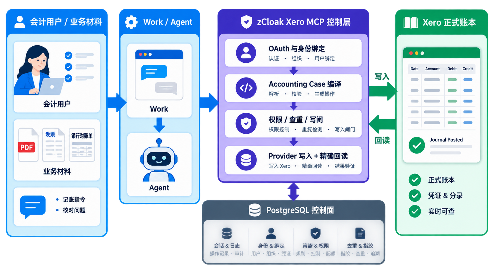
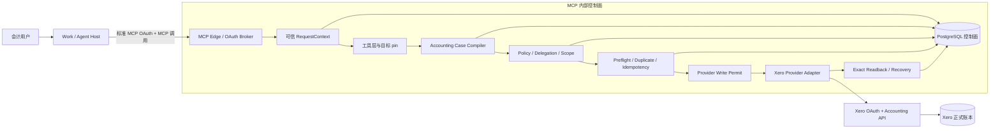
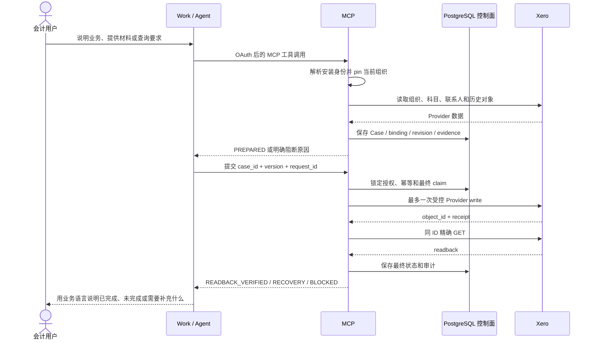

# zCloak Xero MCP（MVP Zero）当前状态说明

核对日期：2026-08-17  
代码版本：`0.4.0-rc.1`  
定位：面向 Agent/Work 的 Xero 会计 MCP 连接与受治理操作层



## 1. 先说结论

这个 MCP 的核心目标不是重新做一套会计软件，而是把 Agent、会计用户和 Xero 正式账本安全地连接起来：

> Agent 负责理解会计用户的话和材料；MCP 负责确认“是哪家公司、哪个联系人、哪个科目、哪张单据、是否允许操作”；Xero 负责保存最终账务记录。

当前版本已经从“模型直接调用若干 Xero API”升级为“有身份绑定、有账套目标、有确定性编译、有授权门禁、有重复检查、有写后回读”的受治理 MCP。

当前最准确的状态是：

- **读取能力：已形成完整的 MVP 能力面，并在公开 MCP 上做过只读 UAT。**
- **Accounting Case 和受控草稿写入：代码和本地/隔离 PostgreSQL 测试已覆盖，线上候选仍保持写关闭。**
- **Work/Agent2 的 OAuth 连接：MCP 侧连接和安全校验正常；个别平台 Agent 配置和客户端凭据仍可能阻断对话级 UAT。**
- **真实来源文件真实性：当前 MCP 不声称已经验证原始文件，只验证调用方提交的事实集合和 Xero 写入回执。**
- **自主生产写入：没有绕过发布门禁打开，仍需正式发布流程和外部治理材料。**

因此，不能把“OAuth 成功”或“工具能调用”直接说成“已经完成记账”。真正的记账完成必须有 Xero 对象 ID、Provider receipt 和同 ID 精确回读。

## 2. 最早的业务需求是什么

最初需求可以概括为六件事：

1. 会计人员在 Agent/Work 中连接自己的 Xero 组织。
2. Agent 能读取组织、科目、税率、联系人、发票、账单、信用票据、报表等存量账务。
3. 会计人员可以用自然语言描述业务，Agent 结合用户提交的材料，形成一张可检查的会计业务单据。
4. 系统能把这张单据映射到正确的 Xero 账套、联系人、科目和税处理。
5. 在明确授权和受控测试账套中，系统可以创建受支持的 Xero 草稿，并且不会因为重复调用、组织切换、网络中断或模型误判而重复记账或串账。
6. 所有结果都能审计：谁发起、哪个连接、哪个组织、什么授权、写了什么、Xero 返回了什么、回读是否一致，都要能够解释。

这里有一个重要产品边界：Xero 是正式账本。MCP 的 PostgreSQL 只保存连接、授权、Case、幂等、写入状态和审计证据，不复制一套平行总账。

## 3. 这轮迭代主要解决了什么问题

### 3.1 解决“模型理解错就直接落账”的风险

模型现在只能提交普通业务事实，例如客户名称、供应商名称、金额、日期、业务说明和来源集合；不能直接提交 Tenant ID、Xero Provider ID、账号 payload、税码 payload、写入路由或回执。

MCP 服务端会重新解析和封存：

- 当前 OAuth 连接对应的 Xero 组织；
- 当前组织的科目表和税率；
- 联系人的法律身份和生命周期；
- 单据属于销售发票、供应商账单还是信用票据；
- 正式编号、Reference、日期和重复范围；
- 每一行的科目、税类别、税率和金额桥。

模型可以提取错，但错误不能直接成为 Provider 写入指令；解析不出唯一答案时，MCP 会停下来。

### 3.2 解决组织切换和“串账”风险

连接后，MCP 会把 OAuth installation、binding、connection 和 Xero tenant 绑定起来。会计对话先调用 `xero_pin_current_organisation`，得到短时、不可猜的目标引用；后续账本工具都必须使用同一目标。

用户需要换公司时，必须走明确的组织切换链接并重新 pin。切换不会悄悄改变另一条并发对话的目标。

这解决的是最危险的一类错误：用户正在看 A 公司，Agent 却因为一个可变的“当前公司”指针，把后续读取或写入送到了 B 公司。

### 3.3 解决本地记录不知道 Xero 历史的问题

重复检查不再只看 MCP 自己的数据库。对受支持的原生单据，MCP 会在准备阶段以及最终写入前查询 Xero 历史记录，并做完整分页、精确匹配和必要的单据 GET。

结果分为：

- 找不到：才可能准备创建；
- 已有完全相同对象：走不写入的 existing-object 结果；
- 有多个候选、分页不完整或字段不一致：直接阻断；
- 已经出现写入不确定：只允许按原对象 ID 做恢复性读取，禁止盲目重写。

### 3.4 解决联系人生命周期和跨角色问题

联系人不再只按“显示名称 + 客户/供应商角色”判断。系统使用更稳定的法律身份、注册号等 durable identity，并覆盖 ACTIVE、ARCHIVED 等 Provider 生命周期。

同一个法律实体同时出现在应收和应付场景时，目标是复用同一个联系人对象，并把用途作为集合；已归档或状态不明的强身份对象不会被当成“没找到”后直接新建。

### 3.5 解决“准备成功但写入前状态已经变化”的问题

Case 的 prepare、preflight、permit 和最终 claim 是不同阶段。每个阶段都会重新确认：

- OAuth scope 和连接是否仍有效；
- 目标组织是否仍是同一个；
- Case version、binding revision 和 target session 是否一致；
- Standing Delegation 是否仍有效；
- 紧急写闸是否打开；
- Xero 历史对象和业务 coordinate 是否仍未冲突；
- Provider 能力和外部治理状态是否仍满足要求。

任何阶段漂移，Provider mutation 都应为 0。

### 3.6 解决“写了但不知道是否成功”的问题

写入不是收到 HTTP 2xx 就算成功。MCP 会：

1. 先保存 Provider 返回的对象 ID 和写入回执；
2. 使用同一个对象 ID 精确 GET；
3. 核对组织、联系人、编号、状态、行项目、科目、税额、总额和关键经济字段；
4. 只有一致才返回 `READBACK_VERIFIED`；
5. 不确定或不一致则进入恢复状态，不自动再创建一笔。

### 3.7 需求、设计和结果的对应关系

| 原始需求 | MCP 采用的设计 | 当前结果 |
|---|---|---|
| 会计人员能连接自己的 Xero | OAuth Broker、加密 Token、Installation/Binding/Connection | OAuth 连接和组织选择已验证；生产多人身份仍有明确边界 |
| 不要记错公司 | 服务端绑定 Tenant，调用前 pin 目标，切换后重新 pin | 目标串用会被拒绝；并发对话目标不会互相改写 |
| Agent 能理解自然语言单据 | 普通业务输入 → typed facts → Case compiler | 可编译 Invoice/Bill/Credit Note 草稿候选；不接受模型直接交 Provider payload |
| 不要把同一张单据记两次 | Xero 历史查重、业务 coordinate、幂等 CAS、exact readback | 本地已有记录和 Provider 历史都纳入检查；不完整或有歧义时停止 |
| 科目、税率和联系人要正确 | 租户 COA profile、税义绑定、durable contact identity、逐行金额桥 | 账套差异、联系人冲突、税义不一致会阻断整张单据 |
| 网络/进程异常不能重复写 | WRITE_IN_FLIGHT / UNCERTAIN / MISMATCH 状态机 | 不确定结果只允许按原对象恢复性 GET，不盲目重写 |
| 结果要能审计 | PostgreSQL 控制面、Provider receipt、readback、audit events | 连接、Case、授权、写入和恢复状态都有持久证据 |
| 原始文件不能被夸大成已验证 | source claim 与 ledger completion claim 分离 | 可以证明账本回读，不把它说成原文件真实性证明 |

### 3.8 审计发现与对应修复

之前审查发现的主要问题，不是单一提示词问题，而是“模型输出曾经离写入太近”。这轮对应做了以下底层收口：

| 发现 | 风险 | 对应修复 |
|---|---|---|
| 只依赖模型或对话中的当前组织 | A/B 公司串账 | OAuth binding + target session + 组织切换确认 |
| 只查 MCP 本地数据库 | Xero 中已有人工/其他系统单据却再次创建 | Provider 全历史分页查重 + 精确 GET |
| 联系人按名称或角色硬匹配 | 同名、归档联系人或 AR/AP 跨角色错配 | 法律身份优先、生命周期扫描、usage roles 集合 |
| AP/AR 正式编号映射不严谨 | 查重和读回看似成功，实际查错字段 | route-specific provider field contract + create/readback/history 一致 |
| prepare 时正确、permit 时已漂移 | 旧授权或旧科目继续写入 | preflight 与 final claim 双重重查，数据库锁和 revision |
| Provider 返回未知结果后自动重试 | 产生重复账单或信用票据 | durable recovery 状态，只做原对象读取 |
| 普通环境变量自称治理授权 | 非唯一编号存在跨系统并发写风险 | 外部 firm governance evidence、revision、hash、expiry 和 kill switch |
| 只用测试/静态证据宣称上线 | 把本地实现误说成线上业务完成 | 线上只读 UAT、独立 release evidence 和写闸分开 |

## 4. 当前对外提供的 28 个 MCP 工具

当前公共面是 28 个工具，分成三组。

### 4.1 读取工具

包括：

- 连接状态和组织信息；
- Accounts、Tax Rates；
- Contacts 的 list/get/search；
- Invoices、Supplier Bills、Credit Notes、Payments；
- Quotes、Purchase Orders；
- Manual Journals；
- Items；
- Bank Transactions；
- Trial Balance。

所有读取都有分页、数量或输出大小边界。Trial Balance 是受限 Provider 视图，不能被说成完整审计、税务申报或全账套证明。

### 4.2 组织目标工具

- `xero_pin_current_organisation`：锁定当前会计对话使用的 Xero 组织。
- `xero_start_organisation_switch`：发起明确的组织切换确认流程。

组织切换只改变当前安装或当前目标的后续使用方式，不会自动改写 Xero 数据。

### 4.3 Accounting Case 工具

- `xero_prepare_accounting_case`：接收普通业务字段，编译一张不可变的 Case 计划；不写 Xero。
- `xero_execute_accounting_case`：只执行已持久化、已授权、已预检的 eligible operations，不接受 Agent 重新提交 payload。
- `xero_get_accounting_case_status`：返回覆盖、残余异常、Provider receipt 和 readback 状态。

旧的 object-level mutation adapter 仍可存在于 MCP 内部测试和 Provider 层，但不再向 Agent 公布，不能绕过 Accounting Case。

## 5. 当前可以做什么，不能做什么

### 可以做

在有效 OAuth、精确组织目标、有效 Standing Delegation、专用测试 Tenant 和全部门禁成立时，当前 Case 设计支持：

- Sales Invoice 草稿；
- Supplier Bill 草稿；
- 未分配的 Credit Note 草稿；
- 基础联系人创建；
- 上述对象的历史查重、确定性编译、受控写入、Provider receipt 和精确回读；
- 只读组织查询、科目/税率/联系人/发票/账单/信用票据/报表调查；
- 多组织连接下的明确选择和短效目标隔离；
- 写入不确定时的 GET-only 恢复。

### 明确不做

当前不开放：

- AUTHORISE、SUBMIT、POST 等正式入账确认；
- Payment、Prepayment、Receipt、Refund 创建或分配；
- Bank Transaction 写入、Bank Transfer、最终银行对账；
- Void、Delete、Archive、Merge；
- Account/Tax 设置写入；
- 高风险联系人银行资料、付款条款或税务关键字段修改；
- Item 价格、库存价值、科目或税码修改；
- 附件上传、Tax filing、Payroll、Month-end close、审计意见；
- 任意 Tenant、任意 endpoint、任意 JSON 或通用 HTTP 代理；
- 脱离 Case、来源覆盖、授权和 readback 的批量写入。

## 5.5 四条核心业务工作流

### 工作流 A：首次连接与组织确认

```text
用户点击连接
→ MCP OAuth Broker 发起 PKCE
→ Xero 授权并选择组织
→ MCP 保存 installation / connection / binding
→ Agent 调用 pin
→ MCP 返回短效 target_session_ref
→ get_organisation 验证组织和币种
```

### 工作流 B：只读调查

```text
pin 组织
→ 读取组织、科目、税率、联系人和单据
→ 结果带分页/范围说明
→ Agent 用会计语言总结
→ 不创建任何 Xero mutation
```

### 工作流 C：受控 Accounting Case

```text
普通业务事实
→ prepare（服务端解析和编译，不写 Xero）
→ 业务人员检查计划和例外
→ execute(case_id + version + request_id)
→ preflight / delegation / duplicate / permit
→ Xero 创建受支持草稿
→ object ID + receipt
→ 同 ID 精确回读
→ status 返回 VERIFIED / RECOVERY / BLOCKED
```

### 工作流 D：组织切换或异常恢复

```text
用户明确提出换公司
→ MCP 生成一次性确认链接
→ 用户选择已授权组织
→ 旧 target 撤销
→ Agent 重新 pin
→ 后续调用只使用新 target

如果写入结果不确定：
→ Case 进入 recovery
→ 只按原 Provider ID GET
→ 读回确认后收敛状态
→ 禁止自动 create 重试
```

## 6. 架构图



### 各层的职责

| 层 | 做什么 | 不做什么 |
|---|---|---|
| Work / Agent | 对话、材料理解、工具编排、展示结果 | 不决定 Xero Tenant、Provider ID 或最终写入 payload |
| MCP Edge / OAuth | 验证 MCP token、PKCE、issuer、audience、撤销和安装身份 | 不把 Xero token交给模型 |
| RequestContext / Binding | 绑定 actor、workspace、installation、connection、tenant 和 revision | 不信任普通 Header 或对话里的身份声称 |
| Tool layer | 提供有限、可解释、带边界的工具 | 不提供任意 endpoint/JSON |
| Accounting Case | 把普通业务事实编译为不可变计划 | 不接受 execute 时重交金额、科目或 tenant |
| Policy / Authority | 检查 scope、Standing Delegation、紧急写闸、Firm Governance | 不把聊天中的“我同意”当授权 |
| Provider Adapter | 调 Xero 官方 API、分页、写入、错误和回读 | 不自建第二套总账 |
| PostgreSQL | 保存授权、连接、Case、状态机、幂等和审计证据 | 不替代 Xero 账本余额 |
| Xero | 保存最终正式会计对象 | 不知道 Work 对话的业务语义 |

## 7. 一次业务操作是怎样走完的



## 8. 不同角色怎么看这个系统

### 8.1 会计人员

会计人员关心的是：我连的是哪家公司、系统看到了哪些账、它准备怎么记、出了问题会不会重复记。

现在的交互重点是：

1. 连接 Xero 并明确选择组织；
2. 先读取和核对组织、科目、联系人及历史单据；
3. 用自然语言描述业务或提交材料；
4. MCP 返回 Case 计划和例外；
5. 只有授权和全部校验成立时才执行受控草稿；
6. 最终查看 Xero 对象状态、回执和逐项回读。

会计人员不需要提供 Xero Provider ID，也不应该通过聊天告诉 Agent“这次一定用某个内部账号”。

### 8.2 Agent / 模型

Agent 的职责是：理解会计语言、整理材料、调用正确工具、解释结果、在信息不全时追问。

Agent 不拥有：

- 随意选择 Tenant；
- 随意指定 Account ID、Contact ID 或 Provider object ID；
- 在 execute 时修改金额、税码或路由；
- 把“我已经写了”当成写入证据；
- 在不确定写入后重新 create。

### 8.3 MCP

MCP 是整个体系的确定性控制层。它负责身份、目标、账套、规则、查重、授权、写入、回读、恢复和审计。

MCP 的原则是：**不要求模型永远正确，而是让模型即使理解错，也不能直接造成错账。**

### 8.4 Work / Agent Host

当前版本对 Work 的要求尽量小：支持标准 MCP OAuth、保持连接 token、让 Agent 能连续调用工具并传递 `target_session_ref`。

当前个人/测试 POC 中，MCP 可以自己生成安装级身份；因此不要求 Work 立刻新增 Workspace 字段或自定义身份 Header。

但如果未来要做真正的企业级多人权限继承，例如不同 Work 员工在同一 Agent 中有不同账套和审批权限，届时需要 Work 提供可信的用户/Workspace/角色声明。这属于下一阶段的企业身份契约，不应假装当前已完成。

### 8.5 Xero

Xero 仍是唯一正式账本。MCP 使用 Xero 标准 OAuth、Accounting API 和 Provider 回读；Xero 不需要为本项目改 API。

### 8.6 部署与治理人员

部署人员负责 MCP 侧的：

- Xero OAuth client 和 redirect URI；
- 数据库和 migration；
- Tenant COA profile；
- Standing Delegation；
- 写闸和 authority revision；
- 非唯一 Provider coordinate 所需的外部 firm governance 文件；
- read-only / controlled-write 的发布配置。

这些是 MCP 的部署与治理配置，不是 Work 业务代码改造；但它们不能由 Agent 或聊天自动伪造。

## 9. 当前验证状态

### 已验证的代码和环境层

- TypeScript typecheck、production build、diff check；
- OAuth broker、PKCE、token rotation、revocation、replay 和连接绑定；
- HTTP/OAuth required tests；
- 隔离 PostgreSQL migrations 和 repository 状态机；
- Accounting Case 编译、金额/税义、联系人、历史查重、恢复和 exact readback；
- 生产 compose 的非 root、read-only rootfs、cap drop、资源限制和健康检查；
- 公开 MCP 只读读取、组织 pin、权限拒绝和 unknown Case 的零写入结果。

### 已做过的线上只读 UAT

在 `https://mcp.jiayuanwang.xyz` 的 0.4.0-rc.1 候选 UAT 中：

- OAuth 连接、Xero consent、组织选择和回到 Host 的流程成功；
- 公开健康检查为 ready；
- 成功 pin `Demo Company (Global)`；
- 成功读取 AP/AR 发票有界页面；
- 未知 Accounting Case 被拒绝；
- UAT 前后 mutation request、posting request 和 Accounting Case 计数保持不变；
- 线上运行模式为 `READ_ONLY`，写闸关闭。

详细证据见 [ONLINE-UAT-RESULTS.md](../artifacts/test-runs/2026-08-15-xero-042-final-uat/ONLINE-UAT-RESULTS.md)。

### 当前不能宣称的内容

- 不能把线上只读 UAT 宣称成生产自动记账已开放；
- 不能把所有 Agent/Work 对话 UX 都宣称完成：平台侧重复 Agent 配置和 Agent2 client ID 不一致仍会阻断部分 Host 流程；
- 不能把本地 reviewer/traceability 机制的 OPEN 项宣称关闭；
- 不能把 `source_truth_claim=NOT_VERIFIED` 改写成“原始文件已验证”；
- 不能把一页有界列表改写成完整账套或审计结论。

## 10. 最终产品判断

从 MVP 目标看，当前版本已经具备一个清晰的产品闭环：

> 用户连接 Xero → 选择组织 → 读取真实账 → Agent 整理业务事实 → MCP 编译和校验 → 在授权下生成受控草稿 → Xero 回读确认 → 记录可审计结果。

它的核心价值不在于“让模型更会猜”，而在于把模型放在理解层，把身份、账套、权限、唯一性和写入证据放在 MCP 的确定性控制层。

当前最适合的产品定位是：

- **只读会计助手：可以对外演示和做线上 UAT；**
- **受控测试账套草稿助手：代码路径已形成，但需要按发布门槛单独开启；**
- **面向多企业、多用户的自动生产记账平台：还需要真实 Host 身份契约、正式外部治理材料和完整发布证据，不能仅凭当前个人 POC 宣称完成。**

## 11. 推荐的下一步边界

为了不让范围继续膨胀，后续只保留三件事：

1. 固定当前版本的 release candidate、证据和线上只读状态；
2. 在专用测试 Tenant 上完成一条 Sales Invoice、Supplier Bill、Credit Note 的受控草稿链，并取得 receipt/readback；
3. 只有在平台配置和正式 release gate 都通过后，再决定是否提交 GitHub 和打开写闸。

暂不扩展到 Payment、银行对账、税务申报、Payroll、完整企业身份、QuickBooks 公共抽象或第二套账本。

## 12. 相关笔记

- [[Accounting Workflow V1 Skill 需求梳理]]
- [[ACCOUNTING_USER_LIFECYCLE_REQUIREMENTS_AND_ROADMAP]]
