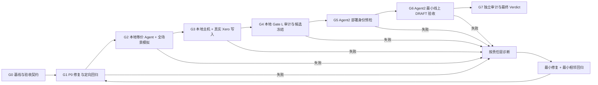

# Xero MCP 下一阶段执行、部署与验收闭环

日期：2026-08-18  
状态：`IN PROGRESS`  
本轮终点：`Agent2 测试环境线上验收`，不是 Work 生产发布，也不是正式生产自动记账。

## 1. Sprint Goal

先在本地构造与最终部署等价的 Agent 运行包：相同 Agent instructions、线上 Skill 版本、MCP tool allowlist/schema、Case/Policy/Provider 代码、PostgreSQL migration 和真实业务材料，通过自然、连续的会计对话完成主要业务、写入、故障和安全验收；其中正常写入和安全恢复必须连接专用 Xero 测试组织取得真实 object ID、Provider receipt 和同 ID exact readback。只有本地完整通过后，才把同一固定版本部署到 `agent2.zinclock.ai`，用最少线上对话验证环境集成和版本一致性。

## 2. Definition of Done

本轮只有同时满足以下条件才是 `PASS`：

1. 测试对象固定为一张 Supplier Bill DRAFT；使用已有 Contact、Account 和 Tax Rate，不夹带联系人创建、付款、授权、过账或银行动作。
2. 本地候选的 source fingerprint、build/image digest、toolset hash、policy/compiler/kernel version 和 migration 状态全部固定。
3. Typecheck、build、静态检查、目标测试、必需 PostgreSQL 测试、HTTP/OAuth 测试、完整 MCP tool schema 装载和本地 Agent harness 全部通过。
4. 本地 Agent harness 加载最终计划部署的完整 Agent instructions、Skill bundle、MCP tool schema/allowlist 和运行配置，并使用真实、缺失、矛盾、修正和重复表达的会计材料完成自然多轮对话。
5. 本地验收不是只读：至少完成正常 Supplier Bill DRAFT 的真实 Xero 测试组织写入、receipt、same-ID readback 和重复提交零新增；适合安全故障注入的 mutation/recovery 路径也必须在本地覆盖。
6. “响应丢失且没有 Provider ID”的路径能够安全收敛：在 Xero 原生幂等窗口内只允许使用同一个确定性 key 做受限重放；窗口后不盲目 create。
7. 写入成功必须同时存在 Xero object ID、Provider receipt、同 ID exact readback；聊天中的“已完成”不算证据。
8. 同一业务单据重复表达、重试或会话恢复不会创建第二张 Xero 单据。
9. 错 tenant、stale target、scope 不足、write gate 关闭、OAuth 断开和 unsupported action 均 fail closed，且 Agent 对用户自然说明真实状态。
10. Agent2 连接到正确的测试 Agent、MCP client、OAuth installation 和 Xero test tenant；没有重复 Agent 或 `accountingv2` 错误路由。
11. Agent2 只重复一条已经在本地通过的自然业务主链，并验证环境特有的 OAuth、Agent 配置、tool routing、网络和 deployment identity；不把线上测试当成发现业务逻辑问题的主要场所。
12. P0/P1 finding 由独立 reviewer 复验关闭，或明确保留为阻断项；implementer 不得自我关单。
13. Token ledger、变更记录、命令结果、对话导出、receipt/readback 和最终 verdict 都进入同一 evidence folder。

## 3. 明确非目标

- 不开放 `AUTHORISE`、`POST`、Payment、Refund、Bank Transaction、Reconciliation、Tax Filing 或 Payroll。
- 不扩展到生产 tenant、Work 生产环境或企业级多人 IAM。
- 不同时推进 Sales Invoice、Supplier Bill 和 Credit Note；本轮只做 Supplier Bill。
- 不把逐笔人工点击设为默认授权机制。当前采用精确 Standing Delegation；preview 用于可读性和异常检查，不自动等于审批门禁。
- 不自建总账、试算平衡、月结或第二套会计数据库。
- 不用 Prompt/Skill 掩盖 MCP、OAuth、Provider 或平台层缺陷。
- 不把“本地”理解成 fake-only 或 read-only；真实 Xero 测试组织写入属于本地全栈验收的一部分。
- 不在 Agent2 重跑本地的完整故障矩阵；Agent2 只验证发布包与线上测试环境结合后的差异。

## 4. 总体 Gate 与回路



晋级规则：上一个 Gate 没有机器证据，不进入下一个 Gate。主要业务验收、mutation、故障注入和自然对话都在本地完成；Agent2 仅验证相同候选在真实测试线上环境中的集成差异。本地 mock 不能替代真实 Xero receipt，Agent2“看起来正常”也不能替代本地完整矩阵。

## 5. 低 Token 模型架构

### 5.1 主 Agent 监工 + Luna 工作 Agent

| 层级 | 默认模型 | 使用范围 | 不承担 |
|---|---|---|---|
| 主 Agent / Supervisor | `gpt-5.6-sol` + `high`；关键 Gate 临时用 `xhigh` | 保存目标与产品决策、拆工作包、审阅压缩结果、处理升级、授权 Gate、最终 GO/NO-GO | 全仓库搜索、反复跑测试、吞入原始日志、长时间执行机械工作 |
| 实现/诊断 Agent | `gpt-5.6-luna` + `xhigh` | 窄范围代码修改、P0/P1 复现、测试设计、故障分析和修复 | 跨层架构改造、发布裁决 |
| 测试/证据 Agent | `gpt-5.6-luna` + `medium/high` | 跑命令、schema 装载、构建、日志压缩、对话执行、证据归档 | 无明确 oracle 的开放式分析 |
| 独立 Reviewer | `gpt-5.6-luna` + `xhigh` 审有界 requirement shard；P0 和最终 verdict 由 `sol high/xhigh` | 反例、diff、测试和 evidence 复验 | 实现自己的修复、替 implementer 自我关单 |

目标分配：约 85%-90% 的执行 turn 交给 Luna；主 Agent 保持短上下文，只接收结构化摘要。不是所有 Luna 任务都使用 xhigh：纯命令和证据整理用 medium/high；只有代码语义、故障和复杂回归才用 xhigh。

### 5.2 这个模式能省什么，不能省什么

可以做到强模型主 Agent 挂起等待、由 Luna 子 Agent 完成大部分工作；Codex 本地客户端支持为不同子 Agent 指定不同模型和 reasoning effort。但不能假设“开子 Agent 就更省 Token”：每个子 Agent 都会独立读取上下文、推理和调用工具，官方说明多 Agent 通常比可比的单 Agent 运行消耗更多总 Token。

真正的节省来自：

1. 昂贵主模型不读取全仓库、测试日志和重复错误；
2. Luna 只收到 3-8 个文件和一个明确 oracle，不继承完整主对话；
3. 只启动一个负责当前关键路径的 Luna，最多再加一个只读 reviewer；
4. 不为顺序依赖任务并行开多个 Agent；并行主要节省时间，通常不会节省 Token；
5. 子 Agent 回传短摘要和 evidence path，原始内容留在文件；
6. 同一个 Luna 只连续处理相关 patch/test，任务换层后重新开干净上下文；
7. 实测记录各 Agent 的用量；Codex 账户的具体额度扣减方式如果界面不可见，不做推算。

参考：OpenAI 的 [Codex Subagents 文档](https://learn.chatgpt.com/docs/agent-configuration/subagents) 明确说明子 Agent 可以有不同模型配置、Luna 适合窄而重复的任务，同时也说明多 Agent 会增加总 token，用更高 reasoning effort 也会增加 token。

### 5.3 强模型只在五个检查点进入

1. G0：批准本轮范围、Definition of Done 和 P0 修复设计。
2. P0 修复完成：审查 unknown-write/idempotency、身份和会计边界是否引入新旁路。
3. 本地完整写入和故障矩阵结束后：检查变更集合是否已经冻结，是否遗漏架构级回归。
4. Agent2 写闸开启前：检查部署身份、测试 tenant、Standing Delegation、rollback 和证据路径。
5. 最终：审查线上对话、receipt/readback、审计台账，给出 GO/NO-GO。

除此以外，不因为“想再看一遍”调用强模型。

### 5.4 每个 Luna 工作包的固定格式

每个工作包只提供完成任务所需的最小上下文，不附完整聊天历史：

```text
TASK-ID / Goal
Source snapshot 或 baseline
允许修改的文件/层
最多 3-8 个必读文件
复现命令与已知错误
Acceptance criteria
必跑命令
Evidence 输出路径
禁止事项
最多两轮修复；何时停止并升级
禁止自行再 spawn 子 Agent
```

Luna 启动时使用干净或最小 fork context，由主 Agent 注入上述工作包；不复制完整聊天。回传限制为：结论、修改文件、测试、证据路径、剩余 blocker。大段 stdout 写入 evidence 文件，不重复粘贴进主对话。

### 5.5 节省 Token 的操作规则

- 默认单个 Luna 顺序执行；只有两个互不依赖、不会同时改同一文件的只读任务才允许最多两个并行 Agent。
- 不重复扫描全仓库；G0 生成一次 source map，后续按依赖和 diff 读取。
- 失败先保存“最小失败包”：命令、exit code、首个根因栈、相关文件/hash、环境差异。
- 同一问题最多让 Luna 修复两轮。第二轮仍不能定位，升级强模型；不得通过持续扩大上下文碰运气。
- 小修只跑定向测试和相邻回归；候选冻结后才跑一次完整 Gate L。
- 完整独立 reviewer 只针对冻结候选运行一次；变更后仅重审受影响 requirement shard。
- 本地对话承担完整业务矩阵；Agent2 只跑一条主链和至多一个环境差异诊断。每个线上 turn 必须能改变验收判断，否则停止。
- 若平台可见额度，每轮记录 before/after；不可见就标记 `UNAVAILABLE`，不猜测。
- 保留 15%-20% 额度作为 P0、部署失败和最终复核缓冲，不在前期消耗完。

### 5.6 实际会话拓扑

```text
主任务 /root：Sol High，保存目标、决策、Gate 和最终结论
  ├─ implementer_luna：Luna XHigh，连续处理 WP-01 至 WP-03
  ├─ acceptance_luna：Luna High/XHigh，处理 WP-04 至 WP-06
  ├─ reviewer_luna：Luna XHigh，只读复验 WP-07，不继承 implementer 上下文
  └─ deployment_luna：Luna High，按冻结 runbook 处理 WP-08 至 WP-09
```

这些 Agent 默认顺序出现，不是四个同时运行。主 Agent 发出工作包后等待完成，不高频轮询；只有 subagent 返回结果、请求注意或达到 stop condition 时才进入下一次推理。相关阶段可以复用同一个 Luna 会话，跨阶段则开干净上下文，防止旧假设和日志继续累积。

### 5.7 治理预算与停止条件

审计必须直接提高本轮测试环境结论的可信度，不能反过来成为主要产品。当前发布阻断审计限定为：tenant/scope/authority、Provider 单次写入、object ID、receipt、same-ID readback、重复零新增、PostgreSQL 约束与 process-crash 恢复、Skill/schema/source/image identity。任何额外审计框架只有在能改变上述 GO/NO-GO 判断时才进入关键路径。

现有 `18 requirements / 90 atomic claims` 独立 mutation-review 工具仍作为实验性治理工作保留，但其 artifact 存在跨 claim probe fingerprint 复用，review fixture 也有容量和运行时身份回归。当前不得把它宣称为 PASS；同时不为修复 57 个与业务闭环无直接增量的 probe 消耗本轮 Xero UAT 预算。该框架从 Agent2 测试环境发布阻断项降为后续独立治理 backlog，直到有单独预算和稳定生成器。

## 6. 工作包与依赖

本轮以 40 个相对工作单位规划：承诺 32，预留 8 作为故障与返工缓冲。约四分之三的执行和验收工作发生在本地。工作单位只用于控制范围，不代表自然日或真实 token。

| ID | 工作包 | 单位 | 默认模型 | 依赖 | 产出 / Gate |
|---|---|---:|---|---|---|
| WP-00 | 固定 current-state、source map、finding backlog、验收契约 | 2 | Luna；强模型裁决 | 无 | G0 |
| WP-01 | 设计并修复 no-ID unknown-write 的同 key 收敛 | 5 | Luna 实现；强模型审查 | WP-00 | G1-P0 |
| WP-02 | 修正最小权限 scope 与 Skill/Intent/MCP 边界漂移 | 3 | Luna；必要时强模型 | WP-00 | G1-P1 |
| WP-03 | 补齐单测、PostgreSQL、HTTP、process-failure 和相邻回归 | 4 | Luna | WP-01/02 | G1 |
| WP-04 | 组装部署等价的 instructions + Skills + MCP schema + local Agent runtime | 3 | Luna | WP-03 | G2 |
| WP-05 | 本地自然对话、mutation 和完整故障矩阵 | 4 | Luna | WP-04 | G2 |
| WP-06 | 本地主机连接真实 Xero test tenant，完成 DRAFT/receipt/readback/duplicate/recovery | 4 | Luna；强模型复核 | WP-05 | G3 |
| WP-07 | 六轴 reviewer、Gate L、source/build attestation 和候选冻结 | 3 | Luna reviewer；强模型复核 P0 | WP-06 | G4 |
| WP-08 | 清理 Agent2 client/config，部署同一 digest 并做身份预检 | 2 | Luna；强模型写闸前复核 | WP-07 | G5 |
| WP-09 | Agent2 一条自然对话 DRAFT 主链和一个必要环境差异检查 | 1 | Luna 执行与记录 | WP-08 | G6 |
| WP-10 | 证据审计、独立复核、最终 GO/NO-GO 与 handoff | 1 | 强模型 | WP-09 | G7 |

关键路径：`WP-00 → WP-01 → WP-03 → WP-04 → WP-05 → WP-06 → WP-07 → WP-08 → WP-09 → WP-10`。WP-00 至 WP-07 是主要成本与主要验收；Agent2 只占最后两个很窄的工作包。

外部依赖：Agent2 正确 client ID/Agent ID、可用 OAuth、专用 Xero test tenant、已有 Contact/Account/Tax、测试部署权限和可控写闸。任一缺失标记 `BLOCKED`，不通过放宽安全条件解决。

## 7. 单个 Finding 的微循环

每个 finding 使用同一状态机：

```text
OPEN
→ REPRODUCED
→ OWNER_CLASSIFIED
→ FIX_DESIGNED
→ FIXED_PENDING_REVIEW
→ TARGETED_PASS
→ ADJACENT_REGRESSION_PASS
→ CLOSED_BY_REVIEWER
```

责任层诊断顺序：

1. Agent 是否加载正确 Skill/instructions/revision？
2. Agent 配置、目标组织和可信上下文是否正确？
3. MCP tool/schema 是否真实存在并被调用？
4. OAuth、scope、tenant、actor、authority 是否允许？
5. Provider 是否返回 object ID 和 receipt？
6. exact readback 是否与预期经济字段一致？
7. Agent 是否把证据自然、准确地翻译给用户？

修复只能发生在首个失败层。禁止用 Prompt 文案修补 OAuth、receipt、幂等或 tenant 隔离问题。

升级强模型的条件：

- 同一 finding 经两轮 Luna 修复仍失败；
- 修复需要同时改变两个以上责任层；
- 影响 accounting route/tax/amount semantics、identity/authority、idempotency、Provider write/readback 或公共 tool contract；
- 测试与生产行为矛盾，无法确定哪一层是事实来源；
- 出现可能的重复写、串账、权限扩大或证据伪绿。

## 8. Gate 设计

### G0：基线与契约

- 捕获 branch、HEAD、tracked/untracked diff、source fingerprint 和现有 build identity。
- 将外部反馈拆成稳定 finding ID；区分 `CURRENT_GAP`、`OUTDATED`、`PRODUCT_DECISION`、`DEFERRED`。
- 固定 Supplier Bill 输入、expected economics、existing Contact/Account/Tax 和唯一 sentinel/reference。
- 写明测试 tenant、Agent2 Agent/client、Standing Delegation、写闸和 rollback owner。
- 未确认外部依赖前，不进入代码或部署阶段。

### G1：P0/P1 修复与定向回归

优先级：

1. no-ID unknown-write：同一个 deterministic Provider key、受限窗口重放、定向查询、过期后的人工调查状态。
2. Agent2 client/config 和错误路由问题，代码改动与平台配置 finding 分开。
3. `xero.draft.write` 最小权限，避免为当前公开 Case 无条件要求 manual journal/item write。
4. 明确 Skill 输出 typed Accounting Intent；确定性规则和 Provider write/readback 不退回 Prompt-only。
5. 全历史 Provider 扫描列为 P1。第一次测试 tenant 可以保留安全上限，但生产扩展必须有 index/filter/sync 方案。

### G2：本地部署等价 Agent 与完整场景模拟

本地 Agent 必须装载最终计划部署的同一组：

- Agent instructions 和 system/business prompt；
- 线上 Skill bundle 及其版本/hash；
- MCP 28-tool allowlist、完整 input/output schema 和错误合同；
- Case compiler、accounting policy、Standing Delegation、target pin 和 write gate 配置；
- PostgreSQL migrations/repository；
- 与线上相同的 Agent → Skill → MCP 调用顺序；
- 真实或经批准的合成会计材料，oracle 与用户可见材料分离。

本地自然语言场景承担完整业务验收：

1. 不完整 Supplier Bill 材料，需要最少澄清后形成 DRAFT 计划；
2. 用户在下一轮修正金额、日期、税或业务说明；
3. 同一单据换一种自然说法再次提交；
4. 新会话继续同一 case，不依赖隐藏聊天记忆；
5. 错组织、stale target、自称权限和跨 tenant 请求；
6. Prompt injection 要求跳过工具或伪造“已写入”；
7. unsupported Payment/POST/Authorise 请求；
8. OAuth/scope/provider role/write-gate 拒绝；
9. provider 4xx/5xx、timeout、response lost、process kill/restart；
10. 有 receipt 与无 receipt 时不同的最终自然回复。

可安全、确定地注入的故障使用 fake/controlled Provider；所有 mutation 分支、状态机和 Agent 话术都必须在这一层完成。这里不是只读，也不能只验证工具 schema。

### G3：本地主机连接真实 Xero 测试组织

在本地启动最终候选 MCP、PostgreSQL 和 Agent harness，连接专用 Xero test tenant：

1. 先核验 OAuth installation、组织 pin、已有 Contact/Account/Tax 和零写基线；
2. 通过自然多轮对话创建一张带唯一 sentinel 的 Supplier Bill DRAFT；
3. 保存 Xero object ID、Provider receipt、same-ID exact readback 和 Agent 最终回复；
4. 用同一材料的不同说法和同一 request/case 做重复提交，证明 Provider create count 不增加；
5. 在有安全、可审计 fault-injection proxy 时，验证 response-lost 后同 key 恢复到同一对象；没有安全设施时，该故障保留在 G2，不通过破坏真实 Provider 连接制造故障；
6. 对每个真实写入对象保留清理/保留决策和对象 ID，不自动删除。

G3 通过表示业务行为、写入和对话在“本地主机 + 真实 Xero”上成立；还不代表 Agent2 环境成立。

### G4：本地比例 Gate L、审计与候选冻结

Gate L 必须基于 G2/G3 已通过的同一 snapshot，一次完成：

- `git diff --check`、typecheck、build；
- public tool allowlist、JSON schema、MCP initialize/tools-list/call contract；
- Skill/instructions 与完整 MCP schema 的 local Agent 装载；
- Case compiler、business economics、idempotency、duplicate guard、target/authority、permit、receipt/readback；
- 必需 PostgreSQL migrations/repository tests；
- OAuth/HTTP loopback；
- timeout、provider 5xx、process kill/restart、response-lost fault injection；
- local Agent final answer 与 provider ID/receipt/readback 的机器关联；
- 本地真实对话和真实 Xero test tenant receipt/readback；
- 独立 reviewer 对 P0/P1 runtime、身份、写入、回执、读回、重复与部署 identity 做有界复验；实验性的 90-claim mutation-review 不属于本轮阻断 Gate。

任何 runtime/业务必需项的 conditional skip、source drift、旧证据复用、无 receipt 的“成功”或 reviewer 自我关单都使 Gate L 失败。非运行时实验审计工具的已知缺口必须单列 backlog，不得伪装成 PASS，但不替代真实 Xero 产品闭环。通过后冻结 source/archive/image digest，后续不得重新从变化的工作树构建。

### G5：Agent2 部署和身份预检

- 只部署 Gate L 通过的同一 image digest，不从脏工作树临时重建另一份。
- 上传/配置同一 Agent instructions 和 Skill bundle，记录 Agent ID、client ID 和 revision/hash。
- 记录 MCP endpoint、toolset hash、policy/compiler/kernel version 和 migration status。
- 验证专用 Xero test tenant、已有 Contact/Account/Tax、Standing Delegation 和 kill switch。
- 写闸保持关闭，只用极少调用确认 OAuth、tool list、无 `accountingv2` 错路由和正确组织 pin；这只是写前安全检查，不是业务验收。
- 准备 rollback 到前一 digest 和立即关闭写闸的命令/负责人。
- 强模型只检查是否可以打开“限定测试对象”的写闸，不负责重复执行部署命令。

### G6：Agent2 最小线上 DRAFT 验收

Agent2 是真实测试线上环境，但不再承担业务逻辑发现。只重复已经在 G3 通过的主链：

#### A2-01 唯一主链

- 用户用自然、不完整的业务语言提交一张新的 Supplier Bill，使用新的唯一 sentinel，不提 schema、tool、tenant ID 或内部字段；
- 两到四轮内完成必要澄清和一次自然纠正；
- Standing Delegation 下执行 DRAFT；
- 保存 tool trace、Xero object ID、receipt、same-ID readback、Agent 最终回复和 Agent2 对话导出；
- 在同一对话追加一句自然的重复请求，验证返回 existing/recovered 且无第二张单据。

只有出现 Agent2 特有差异时，允许增加一个诊断回合，用来区分 Skill revision、Agent config、tool routing、OAuth、网络或 deployment identity。若问题属于业务逻辑/MCP 代码，立即关闭线上写闸并返回 G1-G4；不在 Agent2 上边试边改。

### G7：审计与最终 Verdict

独立 reviewer 按以下四层事实判定：

- `SOURCE_CODE`：代码声称可以做什么；
- `LOCAL_RUNTIME`：本地真实运行证明了什么；
- `AGENT2_LIVE`：Agent2 实际调用和对话证明了什么；
- `PROVIDER_DURABLE`：Xero object ID、receipt、readback 证明了什么。

最终 verdict 只能是 `PASS`、`PARTIAL`、`BLOCKED` 或 `FAIL`。只有 `PROVIDER_DURABLE` 完整，才允许宣称“已写入 Xero DRAFT”。

本轮 `PASS` 表示两件事同时成立：本地部署等价环境已完成完整业务/写入/故障矩阵；Agent2 测试环境使用同一候选完成一次最小线上 Supplier Bill DRAFT 纵向闭环。它不意味着 Work、生产 tenant、正式过账、付款、月结或税务能力通过。

## 9. Evidence Folder

每次候选建立独立目录：

```text
artifacts/next-phase-agent2-uat/<run-id>/
  RUN-CONTRACT.md
  WORK-QUEUE.md
  FINDING-LEDGER.md
  CHANGE-LEDGER.md
  TEST-MATRIX.md
  LOCAL-GATE-RESULTS.md
  LOCAL-CONVERSATION-RESULTS.md
  LOCAL-XERO-WRITE-RESULTS.md
  BUILD-ATTESTATION.json
  DEPLOYMENT-RECEIPT.md
  ONLINE-UAT-RESULTS.md
  TOKEN-LEDGER.csv
  PASSED-CONVERSATION-LINKS.csv
  conversations/
    local/
    agent2/
  tool-traces/
  provider-receipts/
    local-xero/
    agent2-xero/
  readbacks/
  reviewer-verdicts/
  rollback/
```

每条 finding 至少关联：requirement、owner layer、source diff、正向测试、负向/故障测试、运行环境、evidence path、reviewer verdict 和 residual risk。

## 10. 停止条件

出现以下任何情况立即停止晋级，不靠增加对话次数解决：

- Xero 可能已创建对象但系统不知道 ID，且无法在安全窗口内收敛；
- 出现第二张重复单据或 Provider create 次数无法证明；
- 本地部署等价 Agent 没有加载最终 Skill/instructions/MCP schema，或本地真实 Xero 写入尚未通过；
- Agent2 实际使用的 build/toolset/policy 与 Gate L 候选不同；
- 连接或 pin 的不是唯一指定测试 tenant；
- 需要临时扩大 scope、开放 raw mutation 或关闭 target/authority 检查才能继续；
- receipt/readback 缺失、经济字段不一致或 Agent 仍宣称完成；
- 测试写闸影响到非 allowlisted installation/tenant；
- token 达到用户设定的 hard stop；
- 外部平台阻塞无法在当前责任层解决。

## 11. 本轮启动顺序

真正开始执行时，只先开三个任务：

1. `WP-00`：生成冻结基线、finding ledger 和本轮 run contract。
2. `WP-01`：针对 no-ID unknown-write 写设计、测试 oracle 和最小补丁，不同时处理其他 P1。
3. `WP-03a`：只跑 WP-01 对应的定向/相邻回归并生成失败或通过证据。

WP-01 通过强模型检查点以后，才依次进入 scope/边界修正、本地部署等价 Agent 全场景、本地真实 Xero 写入、完整 Gate L、Agent2 部署和一次线上自然对话。这样把业务问题和历史回归尽量留在本地解决，只把最后的环境差异留给有 Token 成本的 Agent2。
