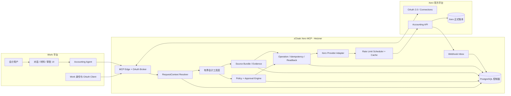
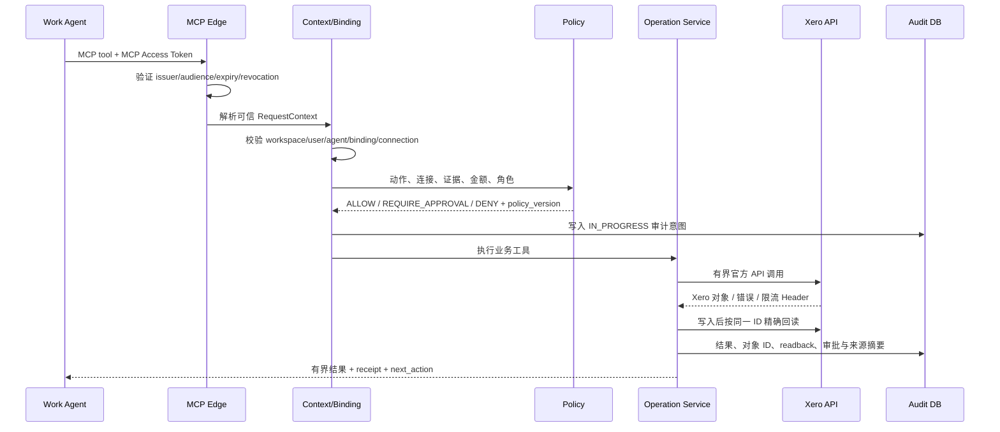
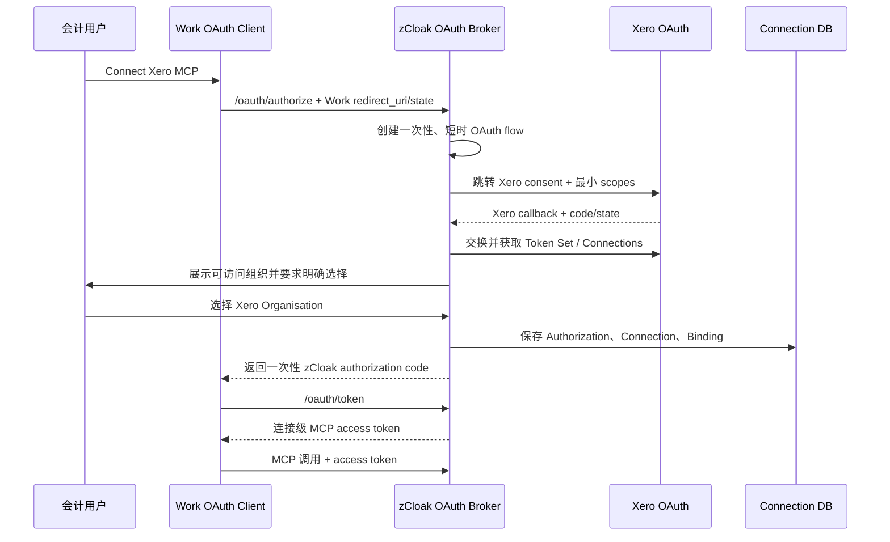

# Xero Accounting Agent MCP 产品架构 V1

版本：V1 Draft  
日期：2026-08-05  
读者：产品、Work / Agent、MCP 后端、安全、QA、会计业务  
配套需求：[PRD-XERO-ACCOUNTING-AGENT-MCP.md](../PRD-XERO-ACCOUNTING-AGENT-MCP.md)

## 1. 架构结论

我们不把 Xero 官方 MCP 原样接到 Work，也不再建设另一套账本。目标形态是：

> Work 中的会计用户通过逐用户 OAuth 连接自己的 Xero 组织；Agent 使用一组业务语义明确、输入有界的 MCP 工具完成读取、分析、匹配和草稿；Xero 保持正式账本；zCloak 的连接层负责身份、账套隔离、证据、策略、审批、防重复、精确回读和审计。

**2026-08-05 宿主决策补充：** 线上主 UAT 改在 Agent2（`agent2.zcloak.ai`）执行，已确认现有 `Accounting MCP` 槽位和回调 `https://agent2.zcloak.ai/api/mcp/accounting-mcp/oauth/callback`。架构中的 Work 应按“MCP Host”理解；Broker、Client、Redirect URI、Installation、Binding 与身份模型必须宿主无关。Work/LibreChat 保留为兼容参考，不是代码中的固定租户或 issuer。

V1 的核心决定如下：

1. **Xero 是唯一正式账本。** MCP 数据库只保存连接与控制面数据，不复制完整总账，不形成第二套余额或凭证体系。
2. **直接使用 Xero 官方 OAuth、Accounting API、OpenAPI 和 `xero-node` SDK。** 官方 MCP Server 只作为工具命名与 API 用法参考，不作为线上运行时的下游 MCP。
3. **保留 zCloak 自建的远程 Streamable HTTPS MCP。** 现有服务已经具备 Hetzner 部署、Token 加密、草稿写入、防重复、回读和审计基础，可渐进改造。
4. **“Agent 自主做大部分事情”限定为读取、分析、准备和受控草稿。** 正式入账、付款、作废、删除、Manual Journal 等高风险动作必须通过确定性策略和人工确认。
5. **不提供任意 Xero API 工具。** 不接受 raw URL、raw `where`、任意 Header、调用方自报 Tenant ID 或通用 HTTP 代理。
6. **Work 身份契约是外部前置依赖。** 在可信的用户、工作区、Agent、会话身份没有被签名传入并验证之前，多用户隔离只能算 Demo，不能算生产能力。
7. **首选“双层 OAuth Broker”接法。** Work 逐用户连接 zCloak MCP；zCloak 再代理 Xero OAuth，并向 Work 签发绑定具体连接的 MCP Access Token。

## 2. 证据边界与当前基线

### 2.1 已经验证

- 现有服务以 Streamable HTTPS MCP 部署在 Hetzner，可被 Work 连接；
- 一个固定 Demo 身份连接一个 Xero Trial 组织；
- OAuth Token 加密保存并支持刷新版本控制；
- 已读取组织、科目、税码、联系人、指定供应商 Bill 和 Trial Balance；
- 已完成 `DRAFT` 供应商 Bill、人工 Review、`AUTHORISED` 和同一 InvoiceID 精确回读；
- 已有写入总开关、单 Tenant 限制、防重复、未知写恢复和审计。

### 2.2 仅验证了 UI 能力，尚未验证隔离

2026-08-05 对 Work 配置页的浏览器检查显示：

- Add MCP 支持 Streamable HTTPS / SSE；
- 认证可选 None、API Key、OAuth、On-Behalf-Of；
- OAuth 可填写 `client_id`、`client_secret`、`authorization_url`、`token_url`、`scope`，并为每个 MCP 提供唯一 Redirect URI；
- 连接卡提供每用户 Connect / Revoke 状态；
- 已有其他 Connector 使用 OAuth 并显示 `Needs Auth`；
- On-Behalf-Of 页面要求 OIDC 类型身份源。

这些结果证明 Work **具备逐用户 OAuth 的产品入口**，但还不能证明不同 Work 用户的 Token 真正分开存储、调用时不串用。正式判断前必须完成一次双用户、双 Xero 组织的负向 E2E。

### 2.3 现有代码的关键差距

| 当前实现 | 风险 | 目标改造 |
|---|---|---|
| 一个共享 MCP Bearer 映射到 `DEMO_ACTOR_ID` | 所有调用看起来来自同一人 | 从 Work OAuth / OIDC 生成可信 `RequestContext` |
| OAuth 回调要求恰好一个 Tenant | 会计无法管理多个客户组织 | Authorization 下保存多个 Connection，并要求用户明确选择 |
| Client Manager 要求一个 Actor 只有一个 Connection | 多组织时直接报错 | 由有效 Binding 解析唯一 Connection |
| Token 与 Connection 存在同一行 | 多 Tenant、重授权和 Token 轮换语义混杂 | 拆分 Authorization、Connection、Binding |
| Review 身份来自本地/Xero 回调会话 | 不能证明是 Work 中有权审批的人 | 使用 Work SSO 用户与角色完成审批 |
| 写入仅有全局开关和单 Tenant 限制 | 无法表达用户、Agent、金额和动作权限 | 引入确定性分级策略，保留全局紧急关闭 |
| 历史读取以精确 ID 为主 | 不符合会计调查习惯 | 服务端白名单过滤、分页、汇总和有界详情 |
| 一个 `source_ref + hash` | 不能表达多材料、字段来源与冲突 | Source Bundle + 字段级 Evidence |
| `posting_requests` 只服务供应商 Bill | 无法复用到销售 Invoice、附件等 | 通用 Operation Proposal / Request 状态机 |

## 3. 官方现成能力与 zCloak 自建边界

| 能力 | Xero 官方现成 | zCloak 需要自建 | 采用方式 |
|---|---|---|---|
| 会计账本与对象 | Organisation、Contacts、Accounts、Tax Rates、Invoices、Credit Notes、Payments、Reports、Attachments 等 | 不自建账本 | Xero 为事实来源，MCP 只调用和回读 |
| 身份授权 | OAuth 2.0、Scopes、Connections、Token 刷新与撤销 | Work 用户到 Xero Authorization / Connection 的绑定 | 使用官方 OAuth；自建 Broker、加密存储和映射 |
| API 客户端 | 官方 OpenAPI 与 `xero-node` SDK | 业务对象标准化、错误语义、边界校验 | Provider Adapter 直接包 SDK |
| MCP 工具 | 官方 `xero-mcp-server` 提供大量 Xero 工具 | 远程 HTTPS、多用户持久化、权限、证据、审批、幂等、回读、审计 | 借鉴工具语义，不把官方 MCP 作为线上下游 |
| 变更通知 | Invoice / Contact 等官方支持类别的 Webhook | HMAC 验签、Tenant 路由、重放保护、队列和缓存失效 | V2 引入事件 Inbox |
| 限流信息 | Tenant / App 限流、响应 Header、`Retry-After` | Tenant 队列、配额预算、写入恢复和可观测性 | 统一 Provider 调度器 |
| 用户对话与材料 | 无 | Work 对话、文件接入、提取、审批 UX | Work 管原文件；MCP 管引用与证据 |
| Agent 风险控制 | 无产品级策略 | 动作分级、策略引擎、人工门控、审批失效 | zCloak 控制面 |

### 3.1 为什么不直接部署官方 MCP Server

核对的官方仓库版本为 commit `f24583c867df7c1f4806f7532eb0691e85892865`。该实现适合本地工具和 API 探索，但当前产品目标还缺少：

- 面向 Work 的远程 Streamable HTTPS 接入；
- Work 用户、工作区和 Agent 身份；
- 多用户 Token 持久化与连接授权；
- 明确的多组织选择，而不是默认使用返回列表中的第一个 Tenant；
- 来源材料、审批、防重复、未知写恢复和精确回读；
- 产品级附件、Webhook、策略和审计闭环。

因此不采用“MCP 再调用另一个 MCP”的双层运行方式。Provider 层继续直接使用官方 SDK，官方 MCP 中合适的对象映射和工具语义可以选择性移植，但每个工具都必须重新经过 zCloak 的 Schema、策略和审计。

## 4. 总体架构



### 4.1 一次 Agent 调用的链路



任何一步缺少可信身份、有效 Binding、必要 Scope、完整证据或允许策略，都在调用 Xero 之前失败。

## 5. Work 身份契约：生产前置依赖

### 5.1 目标 `RequestContext`

```ts
interface RequestContext {
  requestId: string;          // 每次 MCP 调用唯一，服务端生成或验证
  workspaceId: string;        // Work 稳定工作区 ID
  userId: string;             // 当前真实用户，不是 Agent 名称
  agentId: string;            // 当前 Agent 配置 ID
  conversationId: string;     // 会话 / 工作包边界
  oauthInstallationId: string;// Work 中逐用户连接实例
  bindingId: string;          // MCP 服务端解析出的连接授权
  connectionId: string;       // 由 Binding 解析，不接受工具参数自报
  workRoles: string[];        // Work 签名角色；最终权限仍由策略表决定
  authn: {
    issuer: string;
    subject: string;
    audience: string;
    tokenId: string;
  };
}
```

`RequestContext` 只能来自已验证的 OAuth Access Token、OIDC JWT 和服务端数据库解析。以下输入一律不可信：普通 `X-Actor-ID`、模型工具参数中的 `workspace_id` / `tenant_id`、对话文本中的“我是管理员”、以及共享 API Key。

### 5.2 Work 需要提供的最小契约

| 契约项 | 最低要求 | 验收方式 |
|---|---|---|
| OAuth 安装隔离 | 不同 Work 用户分别保存、刷新和撤销 MCP Token | 双用户、双组织 E2E；交叉调用必须 401/403 |
| 稳定身份 | 稳定的 `workspace_id`、`user_id`、`agent_id`、`conversation_id` 或等价签名声明 | Token/JWT 实测并记录 claim |
| Token 验证 | issuer、audience、expiry、JWKS 或 introspection、撤销语义 | 过期、伪造、错 audience 负向测试 |
| 审批身份 | 人类点击产生的事件必须绑定 Work 登录用户、角色、payload hash 和一次性 token | Agent 不能自行生成有效审批 |
| 多组织选择 | 支持多个命名 OAuth 安装，或提供签名的连接选择 ID | 选择 A 后永远不能写入 B |
| 材料引用 | 可提供不可猜测引用、短时下载凭证、SHA-256、MIME、大小和安全扫描状态 | 篡改 hash、过期 URL、超限文件负向测试 |

如果 Work 暂时只能做到“逐用户 OAuth Token”，但不能传入稳定 workspace/user/agent 身份，则可先完成个人 Trial POC；不能宣称团队权限、审批身份或跨工作区隔离已经完成。

## 6. OAuth 与连接架构

### 6.1 三个对象必须拆开

| 对象 | 含义 | 关键字段 | 生命周期 |
|---|---|---|---|
| `ProviderAuthorization` | 一次 Work 用户对 Xero 的 OAuth 授权及 Token Set | authorization_id、workspace、authorized_by、provider subject、scopes、encrypted token、refresh_version | 授权、刷新、扩 Scope、撤销、失效 |
| `ProviderConnection` | Authorization 可访问的一个 Xero Tenant / Organisation | connection_id、authorization_id、Xero connection id、tenant_id、tenant_name、status | 发现、选择、验证、断开 |
| `AgentConnectionBinding` | 谁、在哪个工作区、哪个 Agent 可以怎样使用该 Connection | binding_id、workspace、subject、agent_id、connection_id、policy_id、status | 授予、变更策略、暂停、撤销 |

Token 属于 Authorization；会计组织属于 Connection；产品权限属于 Binding。不得再用一个 `actor_id` 同时代表三者。

### 6.2 首选：zCloak OAuth Broker

Work 把 zCloak MCP 配置成 OAuth Server，而不是直接配置 Xero Token：



Broker 至少提供：OAuth metadata、`/oauth/authorize`、Xero callback、`/oauth/token`、`/oauth/revoke`、连接状态和断开。zCloak MCP Access Token 绑定 `oauth_installation_id + binding_id + connection_id`，不能被调用方换成别的 Tenant。

这一方案的优势是：Xero Token 不进入模型上下文；zCloak 能完整控制连接选择、Scope、审批、审计和撤销；Work 只保存面向 MCP 的连接 Token。

多组织 V1 有一个待确认点：Work 必须支持同一用户建立多个命名 OAuth 安装，或把人工选择的 Connection 以可信声明传入。若两者都不支持，V1 只能“一次 Work 安装绑定一个 Xero 组织”，不能用 Agent 自由切换来代替人工账套选择。

### 6.3 备选：Work 直接持有 Xero Token

Work 直接使用 Xero 的 authorization/token endpoint，MCP 收到 Xero Access Token 后解析 Connections。这条路线可减少 Broker 工作量，但有明显缺点：

- MCP 不容易稳定绑定 Work workspace/user/agent；
- 多组织选择和连接授权更弱；
- Token 刷新、撤销、审计责任分散；
- Review 和操作状态仍必须回到 zCloak 控制面；
- Xero Token 更接近 Agent/MCP 调用边界。

只在 Work 的 OAuth Token 隔离、稳定身份声明、Token exchange 和多组织选择能力全部通过 E2E 后考虑。On-Behalf-Of 作为企业 OIDC 场景的后续选项，不是当前 Trial Demo 的默认路线。

### 6.4 Token 安全与刷新

- Xero Access Token 约 30 分钟；请求 `offline_access` 以获得滚动刷新能力；
- 每次刷新可能轮换 Refresh Token，必须在同一事务中保存最新 Token Set；
- 用 `authorization_id` 做跨实例串行化，采用数据库行锁/租约加 `refresh_version` CAS，不能只依赖单进程内存锁；
- Token 使用独立密钥做信封加密，密钥不与数据库同存，密文以 authorization_id 作 AAD；
- 日志、工具结果、审计和错误中禁止出现 Access Token、Refresh Token、Client Secret；
- 撤销、用户失去 Xero 权限、Connection 消失或刷新失败时，将 Binding 暂停并要求重连；
- Xero API 数据只用于用户当前工作，不进入模型训练或通用训练数据集。

## 7. Scope 渐进授权与能力发现

Xero 新应用使用 granular scopes。Scope 是累加的；新增能力可再次授权，缩小 Scope 需要撤销后重连。因此第一次连接必须克制，不能为“未来灵活”一次申请全部写权限。

| 能力包 | 建议 Scope | 默认时机 |
|---|---|---|
| 连接基础 | `offline_access`；需要展示 Xero 用户时才加 `openid profile email` | 首次连接 |
| 会计基础读取 | `accounting.settings.read`、`accounting.contacts.read`、`accounting.invoices.read` | V1 默认读取；覆盖 Invoice/Bill 与 Credit Note |
| 付款历史读取 | `accounting.payments.read` | V1 `xero.read` 默认读取；只读 Payment，不允许创建、删除或对账 |
| 报表读取 | 所需的 `accounting.reports.*.read`，例如 aged、balance sheet、P&L、trial balance | 按报表功能逐项增加 |
| 附件读取 | `accounting.attachments.read` | 第一次读取 Xero 附件时 |
| Invoice / Bill 草稿 | `accounting.invoices` | 用户启用草稿写入后增权 |
| 草稿附件写入 | `accounting.attachments` | 用户启用附件回传后增权 |
| Payment / Manual Journal 写入 | 不在 V1 默认申请 | 单独产品、安全和会计评审后 |

旧连接若已有 broad scopes，可在兼容层识别 `accounting.transactions` / `.read` 和 `accounting.reports.read`，但新授权不再主动申请；需在官方弃用期限前完成迁移。

MCP 必须提供只读 `xero_get_capabilities`：返回当前连接可用能力、缺少 Scope、策略是否开放和人类可理解的增权入口。Agent 遇到缺 Scope 时返回 `REAUTHORISATION_REQUIRED`，不能静默降级或反复重试。

## 8. 领域模型

### 8.1 Source Bundle

Work 负责文件上传、保存、OCR/文本提取和会话组织。MCP 不接管文件库，只登记完成会计闭环所需的不可变证据。

```ts
interface SourceBundle {
  bundleId: string;
  workspaceId: string;
  conversationId: string;
  version: number;
  manifestHash: string;
  documents: SourceDocument[];
  evidence: SourceEvidence[];
  conflicts: EvidenceConflict[];
  status: "OPEN" | "READY" | "BLOCKED_CONFLICT" | "SUPERSEDED";
}

interface SourceDocument {
  documentId: string;
  workRef: string;
  version: string;
  sha256: string;
  mimeType: string;
  sizeBytes: number;
  documentType: "INVOICE" | "PURCHASE_ORDER" | "RECEIPT" | "EMAIL" | "CONTRACT" | "OTHER";
  malwareStatus: "PASSED" | "PENDING" | "FAILED";
}

interface SourceEvidence {
  field: string;
  normalizedValue: unknown;
  documentId: string;
  locator: string;            // 页码、单元格或邮件段落，不保存无界全文
  extractorVersion: string;
  extractionConfidence?: number;
  confirmedByUserId?: string;
}
```

金额、币种、交易日期、联系人、税额、单据号等关键字段有冲突时，Bundle 状态必须为 `BLOCKED_CONFLICT`。模型置信度只用于解释，不得替代策略和人工确认。材料更新后生成新 version 和 manifest hash，旧 Proposal 自动失效。

如需把原文件传到 Xero，MCP 只从 Work 的白名单文件服务获取短时签名对象，校验域名、MIME、大小、恶意文件状态和 SHA-256，再流式上传。V1 采用更保守的每文件 10 MB、每单据最多 10 个附件上限并配置化；官方不同资源页存在 10 MB / 25 MB 表述差异，生产发布前必须按目标 endpoint 的实时文档回归验证。

### 8.2 Operation Proposal 与 Operation Request

`OperationProposal` 是“Agent 建议做什么以及为什么”，不代表已经允许执行：

- operation：例如 `CREATE_DRAFT_ACCPAY`、`CREATE_DRAFT_ACCREC`、`AUTHORISE_INVOICE`；
- connection_id 和业务对象类型；
- 标准化 payload、payload hash 和预览；
- Source Bundle version、字段级 Evidence、匹配理由和未决问题；
- policy version、初步决策、是否需要审批、过期时间。

`OperationRequest` 是一次稳定、可恢复的执行意图：

- 固定 `proposal_id + payload_hash + connection_id`；
- `request_id` 和服务端 idempotency key；
- 人工审批记录及其绑定的 payload hash；
- Provider 请求/响应摘要、Xero 对象 ID、写入回执和精确回读；
- 状态机和最终错误分类。

建议的通用状态机：

```text
PROPOSED -> VALIDATED -> APPROVAL_PENDING -> APPROVED -> EXECUTING
                         |                  |             |
                         v                  v             +-> READBACK_VERIFIED
                      REJECTED           EXPIRED          +-> WRITE_RESULT_UNKNOWN
                                                        +-> READBACK_MISMATCH
VALIDATED ---------------------------------------------> EXECUTING
  （仅当策略允许无人工审批的 DRAFT_WRITE）
```

任何 Proposal payload、Source Bundle version、Connection 或 Policy version 发生变化，既有审批必须失效。写入返回不确定时禁止再次 POST；先按稳定业务键和已知 Xero ID 恢复查询，再由状态机决定下一步。

## 9. 分级策略与人工门控

### 9.1 动作等级

| 策略级别 | 动作例子 | Agent 默认权力 | V1 审批 |
|---|---|---|---|
| `READ` | 组织、联系人、历史 Invoice/Bill、付款、报表、附件元数据 | 自主 | 不需要；全量审计 |
| `PREPARE` | 汇总、异常分析、匹配联系人/科目/税码、生成 Proposal | 自主 | 不需要；必须展示依据和不确定性 |
| `DRAFT_WRITE` | 创建/更新 `DRAFT` Invoice/Bill、上传附件到草稿 | 授权 Agent 可执行 | 策略可要求确认；必须来源、防重复、回读 |
| `COMMIT_WRITE` | `AUTHORISE`、Credit Note 分配、Payment、Void、Delete | Agent 只能发起 Proposal | 明确人类确认；V1 只保留既有受控 Authorise |
| `FORBIDDEN` | 银行付款、报税、批量不可逆、无人值守 Manual Journal | 不可执行 | V1 禁止，审批也不能绕过 |

### 9.2 确定性策略输入

策略引擎在模型之外执行，至少检查：

- workspace、user、agent、binding、connection 和角色；
- Provider Scope 与连接状态；
- object type、operation、当前 Xero status；
- 金额、币种、批次数量、会计期间、锁定日期；
- Account 类型、Tax Type、Tracking、Contact 是否来自当前连接；
- Source Bundle 是否完整、有无关键冲突；
- 操作是否需要审批、审批人角色、payload hash、有效期和一次性 token；
- 工作区/连接/动作级开关与全局紧急关闭。

策略输出固定为：

```ts
type PolicyDecision = {
  decision: "ALLOW" | "REQUIRE_APPROVAL" | "DENY";
  policyVersion: string;
  reasonCodes: string[];
  constraints: {
    maxAmount?: string;
    maxBatchSize?: number;
    allowedStatuses?: string[];
  };
};
```

规则优先级为：全局关闭 > 明确拒绝 > Scope/连接不足 > 人工审批 > 允许。Agent 的自然语言判断不能改写 PolicyDecision。

### 9.3 审批身份

审批人必须是 Work SSO 登录用户，而不是 Xero OAuth callback 中碰巧登录的人。Work 审批事件至少绑定：`workspace_id`、`user_id`、`proposal_id`、`payload_hash`、动作、角色、时间、一次性 `jti` 和签名。MCP 再查询 Binding/Policy 确认其有审批权；Agent 不能调用工具给自己授予审批。

## 10. MCP 工具域

“灵活”通过完整的业务工具域和能力发现实现，不通过任意 API 代理实现。

### 10.1 Connection & Capability

- 连接状态、连接名称、可用能力和缺失 Scope；
- 发起/继续 OAuth、明确选择组织、撤销连接；
- 展示当前操作策略，不暴露 Token；
- 多组织选择发生在可信 Work/Broker 交互中，不把 Tenant ID 交给 Agent 自报。

### 10.2 Reference & History Read

- Organisation、Accounts、Tax Rates、Tracking Categories；
- Contacts 搜索与详情；
- Invoices 同时覆盖 `ACCPAY` 和 `ACCREC`，支持联系人、日期、状态、搜索、排序和分页；
- Payment、Credit Note、History / Notes、Attachment metadata；
- Trial Balance、P&L、Balance Sheet、Aged Payables、Aged Receivables。

服务端只接受枚举化筛选和有限排序，构造官方 SDK 参数；每页默认 25、最大 100；返回金额、到期、已付、已抵扣、附件标记、分页信息和对象 ID。不能接受 raw `where`、raw order、任意字段展开或无限行数。

### 10.3 Evidence & Prepare

- 登记/读取 Source Bundle manifest，不上传无界正文；
- 校验字段来源、冲突、缺失项和 hash；
- 基于当前 Xero 连接的历史提出 Contact、Account、Tax、Tracking 候选；
- 生成 Bill / Invoice Proposal、预览、置信说明和所需审批；
- 匹配只给候选，不能在 V1 自动创建联系人、科目或税码。

### 10.4 Draft & Controlled Write

- 创建/更新 `DRAFT` ACCPAY / ACCREC；
- 向已验证的草稿上传来源附件；
- 保持现有受控 Authorise 作为 `COMMIT_WRITE`，必须人类批准；
- 每次写入都要求稳定 request_id、payload hash、source binding、精确回读和 receipt；
- Payment/Credit Note 写入或分配、Void、Delete、Manual Journal 默认不注册为 V1 工具；Payment/Credit Note 历史只读工具不在此禁区内。

### 10.5 Operation & Audit

- 查询 Proposal、Approval、Operation 状态；
- 在 `WRITE_RESULT_UNKNOWN` 时只执行安全恢复查询；
- 返回用户可理解的下一步和 Xero deep link；
- 不提供修改审计、跳过审批或强制重试工具。

### 10.6 标准结果信封

所有工具返回统一、有界结构：

```ts
interface ToolResult<T> {
  status: "SUCCEEDED" | "NEEDS_INPUT" | "NEEDS_AUTH" | "NEEDS_APPROVAL" | "BLOCKED";
  data?: T;
  page?: { page: number; pageSize: number; hasMore: boolean };
  receipt: {
    callId: string;
    connectionLabel: string;
    providerObjectId?: string;
    operationRequestId?: string;
    readbackVerified?: boolean;
  };
  warnings: string[];
  nextAction?: string;
}
```

## 11. Provider Adapter 边界

Provider Adapter 是唯一能调用 Xero SDK 的模块。上层只看会计语义，不看 Xero SDK 位置参数和 raw response。

每个 Provider 方法必须做到：

1. 接受已解析的 `connectionId`，内部获取 Tenant 和 Token；
2. 把业务 Schema 转换成官方 SDK 参数；
3. 固定可访问 endpoint、filter、order、page size 和 timeout；
4. 标准化 ACCPAY / ACCREC、金额、日期、状态、分页和错误；
5. 记录 Xero correlation id 和限流 Header，但不记录敏感正文；
6. 写入后按同一 Provider Object ID 回读并比较关键字段；
7. 对网络超时、429、401、Xero validation error、未知写结果给出不同错误类。

不得增加 `xero_request(endpoint, method, body)`、`execute_openapi_operation` 或工具级 `tenant_id` 参数。需要新增 Xero 能力时，按“领域方法 -> 严格 Schema -> Policy -> 契约测试 -> UAT”逐项上线。

## 12. 读取、缓存、限流和 Webhook

### 12.1 不是账本同步

系统采用 **read-through integration**：用户或 Agent 有问题时读取 Xero，必要时使用短时缓存降低延迟和配额消耗。不会定时把全部 Invoice、Journal、Account 复制到本地形成可查询的“影子账本”。

允许保存的仅包括：

- Connection / Scope / Capability 元数据；
- 短时、有限条目的查询缓存；
- 与一次 Source Bundle 或 Operation 直接相关的对象快照；
- 审批、幂等、回读和审计证据。

默认缓存建议配置化：Organisation / Accounts / Tax / Tracking 5 分钟，Contact/Invoice 列表 30 秒，报表 60 秒；写入后对相关键立即失效；写后精确回读和审批页永不使用缓存。缓存键必须包含 workspace、connection、tool、标准化参数、scope fingerprint，并设置行数、字节数和保留上限。

### 12.2 Xero 限流调度

- 按 Xero app + tenant 建独立队列；单 Tenant 并发不超过 5、每分钟不超过 60；
- App 全局每分钟上限与 Tenant 每日上限由配置和响应 Header共同控制；
- 当前官方层级的每日额度不同：Starter 与 Core/Plus/Advanced/Enterprise 不能写死为同一个数；
- Starter/Core/Plus 等连接上限、每日调用额度和 egress 预算由 `provider_app_plan` 配置并在后台告警；
- 使用 `X-DayLimit-Remaining`、`X-MinLimit-Remaining`、`X-AppMinLimit-Remaining` 和 `Retry-After` 动态收敛；
- 大列表使用分页与 `If-Modified-Since`，一次 Agent 任务设置调用预算，防止循环翻页；
- 只读请求可按 `Retry-After` 有界重试；写请求超时后不盲重试，进入未知写恢复。

### 12.3 Webhook

Webhook 只用于失效缓存和触发有限的状态回查，不把事件 payload 当账本，也不在回调线程中执行会计写入：

1. 保留原始 body，使用 Webhook Key 校验 `x-xero-signature`；
2. 未知 Tenant、无效签名、过期或重放事件拒绝；
3. 在 5 秒内快速返回，事件写入 Inbox 后异步处理；
4. 以 tenant + category + resource id + event time/sequence 建去重键；
5. 按 TenantID 映射 Connection，再重建白名单 API 请求；不直接抓取 payload 中的任意 `resourceUrl`；
6. 仅处理官方实际支持的 Event Category；新类别逐项评审；
7. 更新只导致缓存失效或精确回读，不自动生成付款、Void 或 Authorise。

## 13. 数据库目标模型

### 13.1 新增/改造表

| 表 | 关键内容 | 主要约束 |
|---|---|---|
| `provider_authorizations` | Work workspace/user、provider subject、加密 Token Set、scopes、refresh_version、status | Token 不进入 Connection；版本化刷新 |
| `provider_connections` | authorization_id、Xero connection id、tenant、组织名称、状态、last_verified | `unique(authorization_id, tenant_id)` |
| `provider_app_configs` | Xero app、当前 plan、连接上限、日调用上限、egress 预算、生效时间 | 运营配置版本化，不在代码中硬编码层级 |
| `agent_connection_bindings` | workspace、subject user/team、agent、connection、policy、状态 | 每次调用必须命中有效 Binding |
| `oauth_flows` | state hash、PKCE/浏览器绑定、Work redirect、requested capability、过期和消费时间 | 一次性、短时、不可重放 |
| `source_bundles` | workspace、conversation、version、manifest hash、状态 | 不可变版本 |
| `source_documents` | Work ref、version、hash、MIME、size、安全状态 | 不保存原文件 |
| `source_evidence` | field、normalized value、document、locator、extractor/确认人 | 字段级可追溯 |
| `operation_proposals` | binding、connection、operation、payload/hash、source version、policy snapshot | Proposal 修改生成新版本 |
| `operation_requests` | proposal、request/idempotency、approval、provider object、状态、readback | 唯一 `(workspace, connection, operation, request_id)` |
| `operation_sources` | proposal/request 与 document/evidence 的关联 | 删除操作记录时保留审计引用 |
| `operation_approvals` | Work approver、role、payload hash、jti、签名摘要、expiry | 一次性；不能跨 payload |
| `webhook_inbox` | signature result、tenant、category、resource、sequence、处理状态 | 去重和重放保护 |
| `tool_audit_logs` | 完整 RequestContext、binding、connection、policy decision、结果 | 先写 IN_PROGRESS，再完成 |

所有业务控制表都带 `workspace_id` 和 `connection_id` 或可通过不可变外键得到二者。Repository 方法不得只用 `id` 查询敏感对象，必须同时带 workspace/binding 约束。数据库外键和可选 RLS 作为应用校验之外的第二道隔离。

### 13.2 幂等键

现有 `(tenant_id, request_id, operation)` 在不同 Work 用户共用同一 Tenant 时可能冲突。目标键为：

```text
sha256(workspace_id | connection_id | operation | request_id | canonical_payload_hash)
```

数据库唯一约束至少是 `(workspace_id, connection_id, operation, request_id)`；相同 request_id 但 payload hash 不同返回 `IDEMPOTENCY_CONFLICT`，不能覆盖旧请求。

## 14. 数据库迁移方案

采用 expand -> backfill -> dual-write -> cutover -> contract，避免一次性破坏现有 Live Demo。

### 14.1 Expand

1. 新建 `provider_authorizations`、`provider_app_configs`、`agent_connection_bindings`、Source、Operation、Approval、Webhook 表；
2. 给现有 `provider_connections` 增加 nullable `authorization_id` 和官方 connection id；
3. 给 `tool_audit_logs` 增加 workspace/user/agent/conversation/binding/connection/policy 字段；
4. 保留旧列、旧 Repository 和现有工具，所有 DDL 可重复执行。

### 14.2 Backfill

1. 每条旧 Connection 创建一个 Authorization，先不做不安全的跨行 Token 合并；
2. 创建隔离的 `demo-workspace + demo-user + demo-agent` Binding，并继续只允许现有 Trial Tenant；
3. 把 `posting_requests` 映射为 `operation_proposals + operation_requests + operation_sources`，保留原 ID、hash、状态、Xero InvoiceID 和时间；
4. 对回填数量、状态、hash、审计链做逐条校验并生成迁移报告。

### 14.3 Dual-write

1. 新代码读取新模型，缺失时只对 Demo 回退旧模型；
2. 新 Operation 同时写新表和现有 `posting_requests` 兼容层；
3. 比较至少一轮 Trial 写入、审批、未知写恢复和精确回读结果；
4. 禁止在此阶段启用真实多用户写入。

### 14.4 Cutover

1. Work 身份 E2E 通过后，MCP 请求强制要求有效 RequestContext/Binding；
2. Client Manager 改为 `withClient(connectionId, requestContext)`，不再 `resolveSingleConnection(actorId)`；
3. Token 刷新按 authorization_id 运行；
4. 所有读写、Review 和审计只走新 Operation 模型；
5. 线上观察期内保留只读旧表和可回退开关。

### 14.5 Contract

确认无回退流量、数据一致和备份可恢复后，才分批把旧 Token、actor 和 posting 列设为废弃；删除列必须另开迁移，不与功能发布同批。所有密文迁移完成后轮换加密密钥。

## 15. 分阶段改造与验收

### Phase 0：冻结身份与连接契约

工程工作：

- 实现 Broker 协议草案和 Work 配置；
- 与 Work 团队确认稳定身份声明、OAuth 安装隔离、审批事件和多组织选择；
- 完成双用户、双组织 Token 隔离实验；
- 明确 Xero Developer plan 的连接/调用/egress 配额。

退出条件：Work 身份契约已签字确认；双用户交叉调用均被拒绝；否则系统维持 Demo 标记。

### Phase 1：有界历史读取

工程工作：

- 增加 Invoice 列表/详情，同时支持 ACCPAY 与 ACCREC；
- 增加安全 filter/order/page Schema 和标准结果信封；
- 已增加 Payment、Credit Note 有界只读；主要报表读取仍按需增 Scope；
- 保持现有 supplier bill 工具兼容。

退出条件：会计可按联系人、日期、类型、状态调查 12 个月历史；无 raw query、Tenant 注入或无限返回；契约、边界和限流测试通过。该阶段可先在单 Trial Demo 上验证，但不能因此宣称多用户就绪。

### Phase 2：Authorization / Connection / Binding

工程工作：

- 完成 expand/backfill 和新的 RequestContext；
- 上线 zCloak OAuth Broker、明确组织选择、逐用户 Revoke；
- Client Manager 按 connection_id 工作；
- Review 切换为 Work SSO 身份；
- 上线 workspace/agent/connection/action 策略。

退出条件：用户 A/B、工作区 A/B、组织 A/B 的全组合负向测试通过；多组织从不默认选择 `tenants[0]`；Token 刷新竞争与撤销测试通过。

### Phase 3：Source Bundle、Proposal 与草稿

工程工作：

- Work 材料契约、多文档 manifest、字段 Evidence 和冲突规则；
- Contact/Account/Tax/Tracking 候选匹配；
- ACCPAY / ACCREC 草稿 Proposal、写入、防重复和精确回读；
- 附件安全流式上传；
- 通用 Operation 状态机替换 Bill 专用流程。

退出条件：PRD 的多材料分析、会计匹配与草稿、失败与重复安全场景通过；修改材料会使旧审批失效；回读不一致时停止。

### Phase 4：Agent2 会计闭环

工程工作：

- Agent2 展示连接名称、能力、来源、预览、审批、回执、Xero deep link 和错误恢复；
- 完成 Accountant Agent 指令和工具选择回归；
- 上线限流队列、缓存和必要 Webhook；
- 在 Trial / Demo Company 做线上会计视角 E2E。

退出条件：PRD 六个 UAT 场景全部通过；普通用户无需知道 Token、Tenant ID 或 InvoiceID；安全、代码、会计业务和产品共同签字。

### Phase 5：扩大工具域

按业务价值逐项评审 Credit Note、Payment、银行只读、对账建议、月结工作包和批量草稿。每项必须新增 Scope 说明、策略、证据、审批、幂等、回读和专门 UAT。其他会计 Provider 在独立仓库中复用 Authorization / Connection / Binding 和 Operation 模型接入。

## 16. 测试与发布门槛

### 16.1 自动化测试

- MCP tool 名称、Schema、分页上限和标准结果契约；
- Provider Adapter 映射、ACCPAY/ACCREC、日期/金额和 Xero validation error；
- OAuth state、一次性 code、redirect allowlist、Scope 增量、撤销和刷新竞争；
- workspace/user/agent/binding/connection 的交叉隔离；
- Policy 决策表、金额/期间/批量/角色边界；
- Source Bundle hash、版本、冲突、文件域名/MIME/大小；
- Proposal/Approval payload hash 绑定和过期；
- 幂等、未知写恢复、readback mismatch；
- 429 / `Retry-After`、调用预算和无盲重试；
- Webhook HMAC、未知 Tenant、重放、快速 ack；
- Token、Client Secret、材料正文的日志脱敏。

### 16.2 线上发布 Gate

以下任一项未满足即不可开放真实客户写入：

1. Work 双用户 OAuth 隔离尚未实测；
2. RequestContext 缺少稳定 workspace/user/agent 身份；
3. 任一工具可传 raw Tenant、URL、where 或 Header；
4. DRAFT_WRITE 无来源、防重复或精确回读；
5. COMMIT_WRITE 可被 Agent 自我批准；
6. Xero Developer plan 容量、Scope 或 Terms 未确认；
7. Token 加密、撤销、审计或备份恢复未通过；
8. 会计业务负责人未完成 Trial E2E 验收。

## 17. 非功能要求

- **安全**：默认拒绝；Token 不出控制面；最小 Scope；所有敏感查询带 workspace + binding 约束。
- **可靠性**：读请求可恢复；写请求有稳定意图、未知结果状态和精确回读；不静默猜测成功。
- **性能**：普通读取目标 p95 小于 5 秒；报表/大分页明确返回进度或缩小范围，不让 Agent 无限等待。
- **可观测性**：每次调用有 call_id、request_id、workspace、binding、connection、policy_version、Xero correlation id 和结果类；敏感值只保存 hash。
- **可运营性**：可按全局、工作区、连接、Agent、动作关闭；可查看连接数、Scope、刷新失败、429、egress 和未知写积压。
- **合规**：Xero API 数据只服务授权用户的会计工作，不用于训练或贡献给通用 AI/ML 模型；按最新 Xero Terms 更新保留、导出和删除规则。

## 18. 待外部确认事项

1. Work OAuth 是否确实按用户独立保存和刷新 Token；
2. Work 能否向 MCP 提供稳定、签名的 workspace/user/agent/conversation 身份；
3. Work 是否支持一个用户多个命名 OAuth 安装，或可信的组织选择上下文；
4. Work 审批事件是否能绑定真实登录用户、角色和 payload hash；
5. 当前 Xero Developer app 所在 Starter/Core/Plus 层级、剩余连接数、每日额度和 egress 预算；
6. 目标地区/组织上各 Report endpoint、锁定期间、Tax 和 Tracking 的实际行为；
7. Xero Attachment 目标 endpoint 的实时文件大小上限；V1 在确认前保持 10 MB 内部上限。

这些问题不会阻止 Phase 1 在 Trial 组织继续做只读工具，但会阻止 Phase 2 以后宣称“多用户生产可用”。

## 19. 官方参考

- [Xero OAuth Scopes](https://developer.xero.com/documentation/guides/oauth2/scopes/)
- [Xero Tenants and Connections](https://developer.xero.com/documentation/guides/oauth2/tenants/)
- [Xero Accounting API Overview](https://developer.xero.com/documentation/api/accounting/overview)
- [Xero Accounting API Attachments](https://developer.xero.com/documentation/api/accounting/attachments)
- [Xero API Rate Limits](https://developer.xero.com/documentation/best-practices/api-call-efficiencies/rate-limits)
- [Xero Webhooks](https://developer.xero.com/documentation/guides/webhooks/overview/)
- [Xero Developer Pricing and Tiers](https://developer.xero.com/pricing)
- [Xero official MCP Server, reviewed commit](https://github.com/XeroAPI/xero-mcp-server/tree/f24583c867df7c1f4806f7532eb0691e85892865)

官方文档、Scope、层级和限制会变化。上线检查应以构建时 SDK 契约、目标 Xero App Console 和发布当天官方文档三者交叉验证，不能把本文数值永久硬编码。
