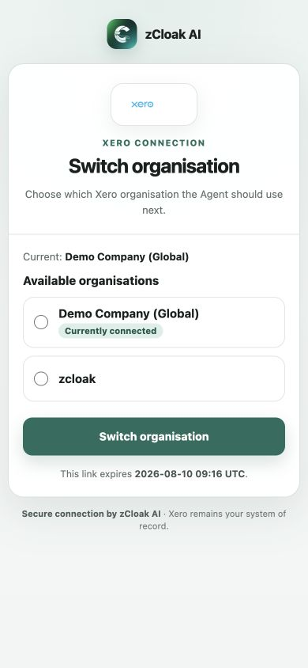

# Xero 会计助理体验指南

更新日期：2026 年 8 月 10 日  
体验入口：https://work.zcloak.ai  
选择 Agent：`Xero 会计助理`

这次体验的重点，是看会计能不能直接用日常语言让 Agent 读取 Xero、理解历史账务，并结合新材料给出可靠的处理建议。Xero 是正式账本；聊天内容和上传材料不会自动变成 Xero 记录。

## 开始前

- 建议使用 Xero Demo Company 或专门的测试公司，不要直接拿真实客户账套试写入。
- 登录 Work 后选择 `Xero 会计助理`。
- 如果页面要求连接 Xero，按提示完成 Xero 官方登录和授权，再在我们的页面明确选择要使用的公司。
- 一个连接在同一时间只使用一个 Xero 公司。想换公司时，直接在对话里说“我要换公司”，Agent 会给出一次性选择链接；不需要先去设置页断开连接。

## 第一步：确认连接的是哪家公司

进入新对话后直接说：

> 先告诉我现在连的是哪家公司、本位币是什么，再简单说一下你目前能帮我做什么。先不要改任何数据。

正确体验应该是：Agent 会从 Xero 读取公司名称和币种，不要求你提供公司 ID，也不会让你复制任何 Token。

## 需要换客户公司时

直接说：

> 这个客户先看到这里。我现在要换另一家公司继续做，给我一个选择公司的入口，先不要改任何账目。

Agent 会给出一次性安全链接。打开后明确选择一家公司并确认；完成后回到对话，让 Agent 重新读出公司名称和本位币。聊天里只说公司名不会直接完成切换。

## 第二步：做一次月末快速盘点

可以直接说：

> 我准备做 7 月底的账。帮我看看应收应付，挑出最值得先跟进的几笔，告诉我先找谁、金额多少、为什么。顺便看一下 7 月 31 日的试算平衡有没有需要复核的地方，别写太长。

重点观察：

- Agent 有没有真的调用 Xero，而不是凭空回答；
- 有没有把客户、供应商、金额、单据和到期情况说清楚；
- 有没有把“试算平衡相等”误说成“已经完成对账、审计或可以关账”。

## 第三步：追一名客户或供应商

从上一轮结果里挑一个名字，像平时问同事一样继续追问：

> 这个客户过去有哪些未收款？哪些已经逾期？有付款或 Credit Note 的话也一起帮我核对一下。

或者：

> 重新去 Xero 查一下这个供应商现在未付的账单，只告诉我单据号、到期日和未付金额。

如果查询有日期、状态或分页范围，Agent 应该说明实际查看了什么，不能把一次查询说成完整审计。

## 第四步：加入材料一起分析

本指南附了两份测试材料：

1. `01-SMART-Agency-测试供应商账单.txt`
2. `02-SMART-Agency-内部处理说明.txt`

把两份文件一起上传，然后说：

> 把这两份材料和 Xero 里 SMART Agency 的历史放在一起看。帮我核对供应商、Reference、日期、币种、金额、可能的重复和科目建议；哪些已经确认、哪些还缺信息要分开说。先不要录入。

这组材料故意没有给出明确税务处理。正确表现是 Agent 先核对 Xero 历史，再指出税务信息缺失；它不应擅自按免税、零税或 No Tax 处理，也不应写入 Xero。

## 第五步：只体验“草稿预览”

如果前面的材料核对合理，可以继续说：

> 先帮我准备成 Xero 供应商账单草稿，给我看完整预览和还缺什么，现在不要写入。

“准备”只是生成预览，不等于已经创建。当前业务体验默认关闭正式写入；只有产品负责人明确安排测试、确认目标是 Demo Company，并临时开启测试写闸后，才可以继续输入一次性确认句。

即使未来执行了草稿创建，也只有同时拿到 Xero 记录 ID、写入回执，并按同一 ID 回读一致，才算创建成功。DRAFT 不等于已批准、已发送或已付款。

## 目前可以做什么

- 读取公司、币种、联系人、科目和税码；
- 查询销售发票、供应商账单、Credit Note、付款、Quote、Purchase Order、Manual Journal、Item、Bank Transaction；
- 读取有范围边界的 Trial Balance；
- 把 Xero 历史和用户上传的材料放在一起做核对、差异分析、重复检查和处理建议；
- 通过会计工作流 Skill 整理材料、复核费用与应收应付、准备平衡的借贷分录建议，并形成月结待办或交接草稿；
- 在明确确认前，准备受控的草稿预览。

## 目前不要期待什么

- 不自动批准、发送、付款、收款、退款或分配 Credit Note；
- 不自动完成银行对账、报税、关账或审计；
- 不作废、删除、归档或合并 Xero 记录；
- 不把一次有限查询说成全账套完整结论；
- 不因为上传材料里写了“已批准”就自动执行。

## 体验后怎么反馈

反馈不用写技术信息，只回答下面五个问题：

1. 连接的公司和币种是否正确？
2. 回答是否像一个可靠的会计同事，是否足够简洁？
3. Xero 事实、材料内容、Agent 推断和未知信息有没有分清？
4. 有没有漏掉明显的会计风险，或者过度下结论？
5. 哪一步最有用，哪一步最别扭？

出现问题时，请附上 Work 对话链接、使用的材料名和问题描述；不要截图或发送密码、Token、Client Secret、Tenant ID 等敏感信息。

当前版本已经完成真实 Xero Demo Company 的公司确认、应收应付盘点、Trial Balance、银行流水和换公司入口验收；会计写入在本轮体验中保持关闭。
