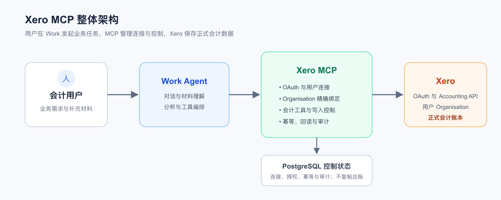
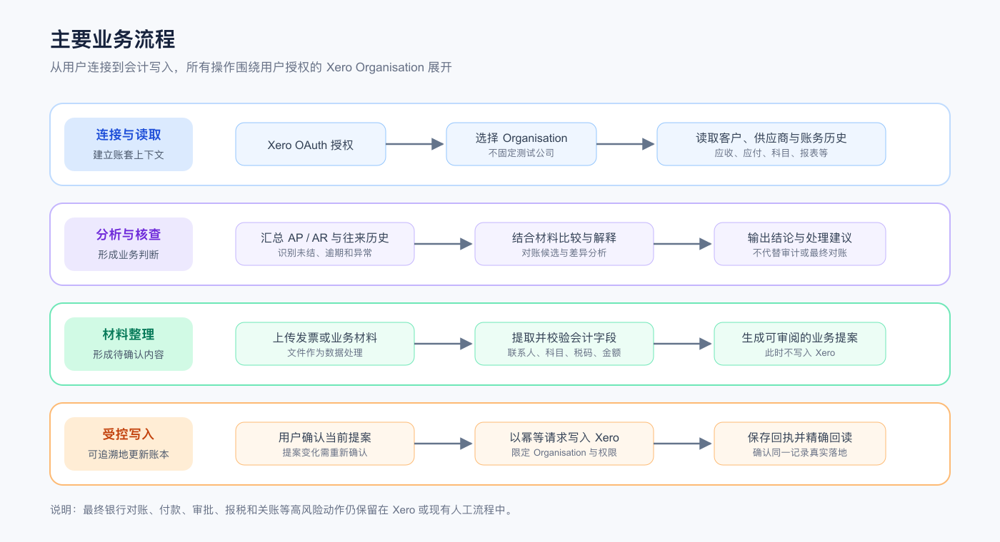
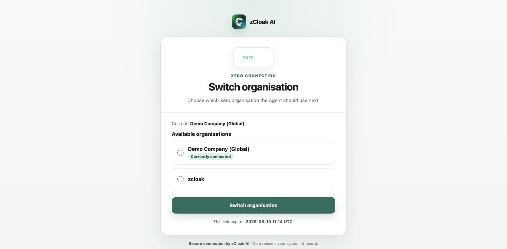

# Xero MCP 开发交接说明

更新日期：2026 年 8 月 10 日

## 项目背景

本项目用于验证 Work 平台与专业会计系统之间的连接能力。产品方向是不再把 Google Drive 或表格作为账本，而是将 Xero 等专业会计软件作为正式会计记录的来源与归宿，Agent 负责理解用户需求、处理补充材料并调用会计系统完成工作。

首期选择 Xero 进行验证。Xero 是面向企业及会计服务机构的云会计平台，客户、供应商、发票、账单、科目、付款和财务报表等正式数据均保存在用户自己的 Xero Organisation 中。目标用户是会计人员：他们在 Work 中连接自己的 Xero 账号后，可以让 Agent 读取历史账务、分析应收应付和客户情况，并结合上传的发票或其他材料，协助整理和录入会计信息。

该能力必须支持不同用户分别授权自己的 Xero 账号和 Organisation，不能将 Agent 固定绑定到某一个测试公司；同一会计也要能在对话中安全切换已授权的代理公司。涉及写入的操作必须保留人工确认和可追溯记录。

## 整体方案

当前实现是在 Work 与 Xero 之间部署一个远程 MCP 服务。会计用户仍然在 Work 中以自然语言提出业务需求，Agent 负责理解任务、读取用户提供的材料并选择相应工具；MCP 则作为受控连接层，统一处理授权、账套边界、会计工具和执行记录。

连接分为两层：Work 通过 MCP OAuth 连接远程 MCP；用户再通过 Xero OAuth 授权其 Xero 账号，并从获准访问的 Organisation 中选择本次连接的目标账套。此后每次工具调用都从服务端绑定关系确定 Organisation，Agent 不能在调用参数中任意切换公司。

MCP 直接调用 Xero 官方 Accounting API，不在中间复制或维护另一套账本。读取结果返回 Work 供 Agent 分析；涉及会计写入时，MCP 先生成可审阅提案，只有用户明确确认后才执行，并保存 Xero 回执及同一记录的回读结果。

多 Organisation 场景下，会计可直接在对话中要求切换公司。Agent 只负责发起切换并返回短效链接；用户必须在 MCP 页面从当前 OAuth 已授权列表中明确选择一家。确认后，服务端更新该 installation 唯一的 current binding，后续请求只解析到新公司。Agent 不能从聊天文本或文件内容直接指定 Tenant。

### 各层职责

| 层级 | 核心职责 | 边界 |
|---|---|---|
| Work Agent | 理解业务意图、组织材料并调用工具 | 不直接保存会计账本 |
| Xero MCP | 授权、账套绑定、工具控制和审计记录 | 不替代 Xero |
| PostgreSQL | 保存授权关系、Token、提案与幂等状态 | 不保存第二套总账 |
| Xero | 保存正式会计记录并返回 Provider 回执 | 最终会计数据来源 |

## 主要业务流程

当前方案围绕四类会计工作组织能力。它既支持读取和分析，也支持把用户材料转化为待确认的会计内容；写入始终经过明确确认和结果回读。

**连接与读取。** 用户完成 Xero 授权并选择 Organisation，Agent 随后可以读取客户、供应商、发票、账单、科目、付款及报表等历史信息。

**Organisation 切换。** 对已授权公司，用户在对话中提出切换后打开一次性链接并明确选择；切换前的提案和旧 binding 不能被带到新公司执行。未授权公司需要重新走 Xero OAuth。

**分析与核查。** Agent 可以基于应收应付、往来历史、Trial Balance 和 Bank Transaction 等信息进行汇总、差异比较、逾期分析和对账候选判断；最终银行对账、审计或税务结论仍由会计人员在正式流程中完成。

**材料整理。** 用户上传发票或其他业务材料后，Agent 提取联系人、日期、金额、科目和税码等信息，结合 Xero 存量数据查重和校验，形成可审阅的业务提案。该阶段不写入 Xero。

**受控写入。** 用户确认当前提案后，MCP 才以幂等请求写入指定 Organisation，并保存 Xero 记录 ID、Provider 回执和同一记录的精确回读结果。付款、审批、最终对账、报税和关账等高风险动作不在当前范围内。

### Agent 会计工作流

线上 Xero 会计助理已启用 11 个 connector-neutral Skills，覆盖工作流协调、材料接收、费用/AP/AR/现金复核、平衡分录建议、经批准执行、月结交接、跟进草稿和管理月结交付。Skill 负责会计判断与业务步骤，MCP 负责 Xero 授权、数据读取、受控动作和证据回执；两层不互相替代。

每个新会话先从 MCP 重新确认 Organisation 和本位币。后续 Xero 读取必须保持同一安全 target reference 与 binding revision；切换 Organisation 后必须重新确认。Trial Balance、Bank Transaction 和有分页边界的列表只形成待复核事项，不能单独证明已对账、无差异、可关账或审计完成。

## 当前验证版本

现有版本用于产品和技术可行性验证，部署在个人测试基础设施。当前代码已经完成 Xero OAuth、Organisation 选择、对话发起的受控 Organisation 切换、账务读取、Token 自动续期和主动断开等核心链路，并实现了受控写入所需的准备、确认、幂等、Provider 回执和精确回读机制。新增治理审计 envelope 记录授权、切换和工具调用的身份、范围、处置、结果及 hash 证据，但当前只可表述为 SAFR-oriented readiness，不是完整 SAFR 合规实现。

该版本可以作为开发接手的代码基线和行为参考，但不能直接视为公司生产环境。2026 年 8 月 10 日固定版本为 0.3.1 build `20260810.1`，线上共有 44 个工具；Agent2 已在新版移动端授权页完成 Demo Company 与 zcloak 的往返切换，Work 已完成真实账套读取和切换入口验收，最终均保留 Demo Company / USD，且全程零写入。正式上线前仍需迁移到公司控制的基础设施，并完成多用户、多 Organisation 隔离、生产监控、备份恢复、安全管理和目标环境验收。

## 交接资料

| 资料 | 用途 | 位置 |
|---|---|---|
| GitHub 源码仓库 | 代码、迁移与部署基线 | [github.com/johnw-max/xero-mcp](https://github.com/johnw-max/xero-mcp) |
| 当前 Work Demo | 0.3.1 真实 Xero 只读验收与换公司入口 | [work.zcloak.ai/c/0168a366-773f-405b-b067-9ede601637d6](https://work.zcloak.ai/c/0168a366-773f-405b-b067-9ede601637d6) |
| 测试 MCP | 迁移前的连通性对照 | `https://mcp.jiayuanwang.xyz/mcp` |
| Work MCP 配置 | 可直接照填的字段、Secret 交接和多人配置边界 | [Work 配置 Xero MCP](../../docs/WORK-XERO-MCP-CONFIGURATION-ZH.md) |
| Xero Developer App | OAuth 配置与回调迁移 | `zCloak Accounting Connector` |
| 发布与线上验收 | 固定版本、测试结果与证据边界 | [Xero 0.3.1 发布与线上 UAT](../../docs/XERO-0.3.1-DEPLOYMENT-AND-ONLINE-UAT-2026-08-10.md) |

源码仓库包含 MCP 服务、Xero OAuth、Provider 适配、业务服务、数据库迁移、部署配置和测试工具。当前地址仅供验证和迁移对照，不作为公司正式生产地址。Client Secret、OAuth Token、数据库凭证及加密密钥不通过 Git 或文档交接。

### Work 配置要点

Work 当前使用 `Streamable HTTPS + OAuth`。测试环境的公开配置为：MCP URL `https://mcp.jiayuanwang.xyz/mcp`、Client ID `work-xero-f70c2c68107535c1`、Authorization URL `https://mcp.jiayuanwang.xyz/authorize`、Token URL `https://mcp.jiayuanwang.xyz/token`、Scope `xero.read xero.draft.write`。Client Secret 已存在，但只能通过公司 Secret Manager 或密码管理工具私下交接，不能写入本文档。

当前 Work Redirect URI 为 `https://work.zcloak.ai/api/mcp/zcloak-ledger-mcp-xero-demo/oauth/callback`。正式迁移时，开发应以 Work 新环境实际生成的 Redirect URI 为准，将完整地址登记到服务端对应 client 的 allowlist。

当前部署仍为 Personal POC，不能把一个 Client ID 直接当作安全的团队共享连接。短期多人验收应为每个独立测试者分配不同的 client ID、Secret 和 Redirect URI；正式产品则应由 Work 统一管理 client，并补齐签名的用户、工作区和 installation 身份后再关闭 Personal POC 模式。具体填写项和验收步骤见上表中的《Work 配置 Xero MCP》。

## 开发接手范围

开发团队接手后，需要基于现有代码完成以下工作：

1. 在公司控制的云环境部署服务，配置正式域名、HTTPS、PostgreSQL、密钥管理、日志、监控、备份和回滚机制。
2. 将 Xero Developer App 纳入公司管理，配置公司回调地址，并按照 Xero 最新的细粒度 OAuth scopes 要求调整授权范围。
3. 在 Work 公司环境重新配置 MCP，并复制或重建正式 Agent，使每位用户通过 OAuth 连接和选择自己的 Xero Organisation。
4. 先保持会计写入关闭，完成 OAuth、Organisation 选择、读取、自动续期、主动撤销和多用户隔离验收。
5. 在独立测试 Organisation 中逐步验收受控写入，确保每次操作均经过用户确认，并取得 Xero 记录 ID、Provider 回执及同一记录回读结果。
6. 完成公司环境切换并稳定运行后，再移除个人测试回调、服务器、数据库和密钥依赖。
7. 以 `022_xero_organisation_switch.sql` 至 `024_allow_binding_history_per_installation.sql` 为基线验证并发切换、事件链、append-only、备份恢复和审计权限；正式上线前用事务 outbox 或等价机制收口业务结果与完成事件的一致性。
8. 将 `agent-skills/accounting-double-entry-skills-2026-08-10` 的 11 个 Skill 与其中的 `agent-config/accounting-agent-instructions.md` 一并迁移到公司 Agent；Skill ZIP 与 Agent instructions 是两类部署物，缺一不可。

Organisation 切换、审计字段、SAFR 映射和 ATP adapter 边界见 [Xero Organisation 切换与治理审计设计](../../docs/XERO-ORGANISATION-SWITCH-AND-GOVERNANCE-AUDIT-ZH.md)。当前未找到 ATP 正式协议规范，代码没有猜测 ATP 字段；后续应在规范确定后新增版本化 mapper/exporter。

当前交接范围仅包含 Xero。仓库内保留的少量 QuickBooks 共享模块用于保持既有运行连续性，不属于本次产品交付范围，后续可由开发团队按正式服务边界拆分。
