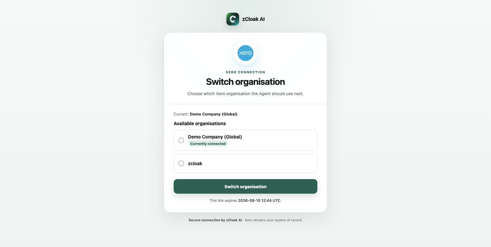
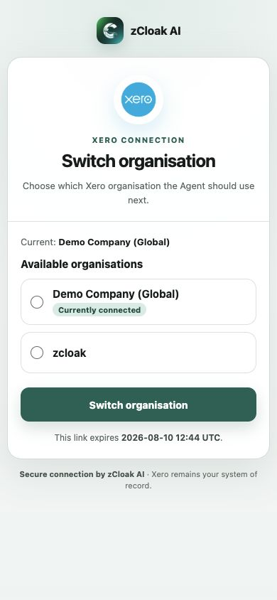

# Xero MCP 老板演示录屏方案

准备日期：2026 年 8 月 10 日  
目标：用少量、完整、像真实会计工作的流程，说明 Agent 如何连接 Xero、理解账务，并在不同客户公司之间安全切换。

## 建议成片

建议录 3 条独立短片。这样老板可以单独转发，也方便某一段出问题时只重录该段。

| 视频 | 建议时长 | 主要说明什么 |
|---|---:|---|
| 01 首次连接并选择公司 | 60–90 秒 | 用户通过 Xero 官方 OAuth 授权，再在 zCloak AI 页面明确选择要处理的公司 |
| 02 会计接手客户并快速体检 | 2–3 分钟 | Agent 从 Xero 读取公司、币种、应收、应付和 Trial Balance，给出有依据的复核优先级 |
| 03 从对话切换客户公司 | 90–120 秒 | 会计不用回设置页；直接说要换客户，Agent 给一次性入口，用户确认后再回读新公司 |

三条视频均不创建、修改、批准、付款、对账或删除 Xero 记录。当前演示版本保持 `XERO_WRITE_ENABLED=false`。

## 推荐观看顺序

1. 先看 01，理解“每位客户授权自己的 Xero、每次明确选择一个公司”。
2. 再看 02，理解会计日常最核心的读取、核对和分析价值。
3. 最后看 03，理解会计事务所处理多个客户公司时，不需要手动断开 MCP。

## 文件结构

- `00-录制前检查.md`：账号、浏览器、隐私与画面设置。
- `01-首次连接并选择公司.md`：第一条视频的逐步脚本。
- `02-会计接手客户并快速体检.md`：第二条视频的自然对话和验收点。
- `03-从对话切换客户公司.md`：第三条视频的完整切换流程。
- `04-成片验收与重录门槛.md`：什么情况必须重录。
- `05-Agent录制执行手册.md`：Agent 实际操作、录屏、点击、输入、等待和滚动的逐镜指示。
- `materials/给录制Agent的启动指令.md`：可直接交给一个新 Agent 的完整任务指令。
- `materials/`：录制时可直接复制的自然话术、日志模板与页面参考图。

## 页面参考

## 当前准备状态

- Xero 官方 1000×1000 透明 Logo 已上线；桌面显示 76×76，390px 移动端显示 70×70。
- Work 已配置 Xero 会计助理，当前 Demo Company 读取主流程已验收。
- 对话内生成公司切换入口已验收；切换必须由用户在页面明确确认。
- 本文件夹只准备录制方案和素材，本轮未开始录屏，也未切换当前公司。

## 录制原则

- 只录浏览器窗口，不录桌面、终端、密码管理器或通知。
- 由 Agent 操作并录制时，使用浏览器窗口捕获。默认保留普通箭头光标，方便观众理解点击位置；关闭点击光圈、自动化高亮和 AI 接管提示。
- 录制前把浏览器缩放恢复到 100%，窗口建议 1440×900 或 1280×800。
- 不展示 Token、Client Secret、Tenant ID、完整 OAuth ticket 或账号密码。
- Agent 的回答如果过长，先调整提问重跑，不在成片里快速滚动大段文字。

Agent 不应边录边临场试错。每条视频先按《Agent 录制执行手册》完成无录屏彩排，再重置到规定起始状态，一次录成；出现错误直接停录并重新开始。

## 不放进本轮老板视频的内容

- 正式写入 Xero 草稿；当前写闸关闭，不能把“准备预览”说成“已经写入”。
- 自动付款、收款、批准、银行对账、报税、关账或审计。
- 用一次有限查询宣称已经检查完整账套。
